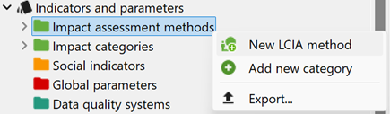
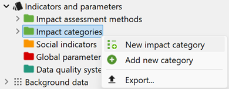

# Creating a new impact assessment method/category/characterization factor

To create a new life cycle impact assessment method:

1. Right-click on the "Impact assessment methods" child category.
2. Select "New LCIA method". 

3. Name the new method and add a description (optional). 

 

4. Click "Finish", to open the the new impact assessment method in the editor.

### Creating a new impact assessment category 

Moreover, you can also create impact assessment categories. This might be helpful if you wish to tailor your impact assessment method to include specific categories like fossil fuel depletion that may not be present in your current method.

To do so:

1. Right-click on the "Impact assessment categories" child category.

2. Select "New LCIA method".

 
3. Name the new method, add a reference unit and optionally a description.

4.	Click "Finish", to open the new impact assessment category in the editor. 

To see how to add impact categories in the impact assessment method window, characterization factors, etc, see the section below.

### Creating and addung characterization factors

In some methods maybe the characterization factors of an substance are missing. Hence you can add (or modify existing) characterization factors (CFs) in a LCIA method.

To add a CF to a LCIA method:

1. Open the method and the respective category you want to add your CF to. Change from "General Information" to "Characterization factors"
2. Click on the green plus in the upper right cornern and select the flow you want to add the CF to and confirm with "OK": 

The flow now has the CF of 1. By selecting the field "Factor", you can modify this number. 

Make sure that you saved the impact category. This is also the way to modify  the characterization factor of an elementary flow. However, you can make sure that you added/modified the CF by opening the elementary flow itself and change to "Characterization factors" tab.

