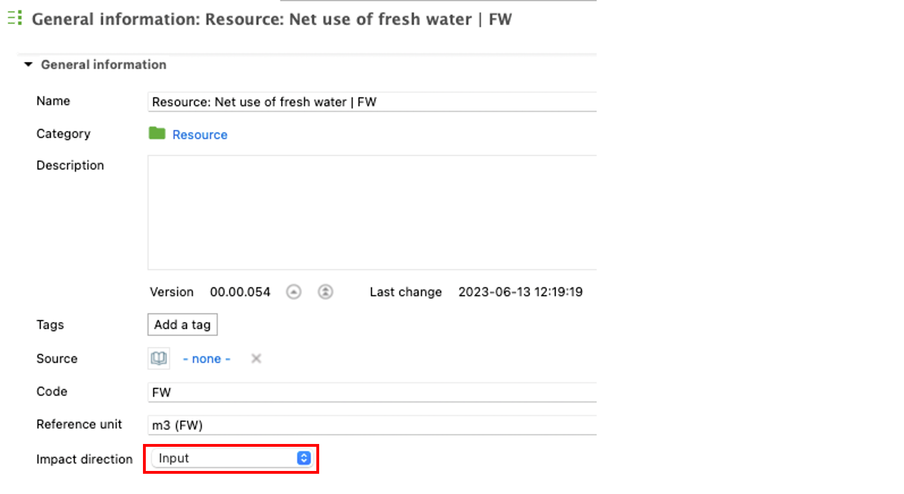
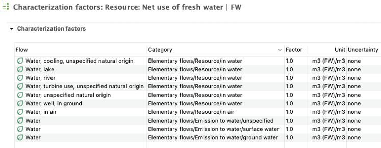
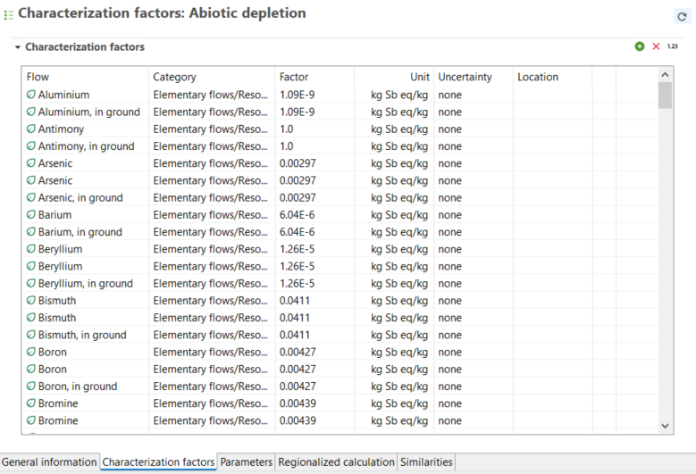
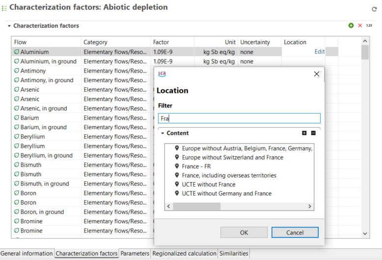
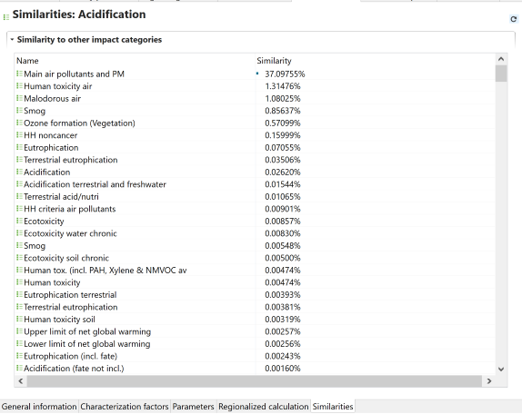

# _**New!**_ Impact assessment category tab contents

In openLCA 2, LCIA categories are now stand-alone entities that are stored outside of an LCIA
method. A single LCIA category can be used in several LCIA methods and an update
of such an LCIA category will update it in all LCIA methods where it is used.
The database update moves the LCIA categories to the new category "Environmental
indicators" in the navigation. 

_**Note**_: As LCIA categories in different LCIA methods
often have the same name, there are also LCIA categories with the same name in
this folder. This can be easily changed by giving these LCIA
categories more descriptive names.

The contents of the impact categories window will be explained in the following.

<b> General information</b>

In this section you can:

Here you can view and modify the name of the category, add a description, a reference unit, additional details or [tags](../cheat/tags.md), along with:

- Adding a source from the sources in the database (see "[database elements](../databases/database_elements.md)")
- Adding a code (i.e., a short name for the category, useful in result views)
- Choosing an impact direction

The image below shows an example of the General Information tab for the CML-IA baseline methodology from ecoinvent:

  
_LCIA category - General information tab_

<b> Used in impact assessment methods</b>

In this helpful tab you can view the impact assessment methods in which this impact category is used and the category that the method can be found in.

<b> Impact direction</b>

**_New_**: In openLCA 2, a new feature allows you to specify the impact direction for each impact category as either "Input" or "Output" (as shown in the figure below). Basically, resource use categories are input, emission-related categories are output. The default setting, when no specific impact direction is chosen, is "Unspecified". With the option "Unspecified", all characterization factors and their signs (plus or minus) will be taken for the calculation as they are written into the factors table of the methods.

  
_General information window of an impact category with the setting for "Impact direction" set to "Input"._

When you choose "Input" or "Output" as the impact direction, openLCA handles the sign of factors automatically, depending if the flow is an input (resource) into a process or an output from a process (emission). This way, the sign of the characterization factors is set during the calculation and displayed in the results. Taking water as an example. In the figure below, an impact method is shown to calculate the net use of fresh water, meaning all water used as an input is summed up and all water lost as an output is subtracted. If the resulting total impact value is positive, more water is used as an input resource than water is emitted in the output of processes and vice versa. When no impact direction is set "Unspecified", the factors for water have to be negative for all flows inside the emission compartments and (correct) modelled as an output of processes. When the impact direction is set from "Unspecified" to "Input", the factors for water can remain positive for all flows (see the figure below). During the impact calculation in this example, openLCA will automatically invert the sign of the water flows in the output of processes. On the other hand, if the impact direction "Output" is chosen, the water flows in the input of processes will be inverted. The inverted value will also appear on the impact analysis window on the results page, so that users can directly see which flows are contributing with a positive sign and which ones with a negative sign.

  
_Water elementary flows and characterization factors (all positive) inside an impact method to calculate the net use of fresh water with the impact direction set to "Input"_

The advantage is that all flows, which are modelled in a "correct" way for resources in the input and emissions in the output of processes can keep their positive factor for the characterization. For example, carbon dioxide emission to air has the characterization factor 1.0 for the global warming potential. The flow for carbon dioxide removal from air (using it as a resource) can also keep the positive number of 1.0, since it is essentially (but not technically) the same elementary flow. Another advantage of setting the impact direction is that negative values for the factors inside the methods (which are of course still possible), will directly show the user which flows are modelled on the "wrong" opposite side of a process. With the example from above, the water output (emissions compartment) can be also modelled as an input with the opposite sign for the factors inside the method. It will be on the "wrong" side, but the impact direction is set to "Input" and the calculation result will be the same. The input gets not inverted and the water factors would remain negative and contribute as an output.

**_Note:_** To correctly respect impact directions users should use the new method packages to obtain correct results: Version 2.0.3 onwards. For more details check our [blog post](https://www.openlca.org/method-package-update-with-impact-directions/) about the topic.

<b> Characterization factors</b>

In this window you can:
- Add/edit flows that are included in the category 
- View the emission category to which the impact category belongs
- Edit the corresponding impact factor, units, uncertainty data
- Add/edit location

_"Characterization factors" tab_

<b> Parameters</b>

Parameters can be used in the same way for LCIA categories as for processes, see please the section "[Parameters](../parameters/parameters.md)".

<b>Regionalized calculation</b>

In openLCA, you can now assign locations to characterization factors and process inputs/outputs. These locations are then used in the new calculation, and shown in the reults. By default, for inputs and outputs, the process location is used, but you can specify a different location at the flow or even exchange level if needed.

More on regionalized calculation can be found in the "[regionalized LCA](../advanced_top/regionalized.md)" section.

  
_Adding locations for flows in impact categories and using filters_

<b>Similarities</b>

In openLCA 2, a similarity check for LCIA categories is available as a separate tab within the impact category editor. This feature can be useful for finding duplicate impact categories.

 
 _Similarity check for LCIA categories_

