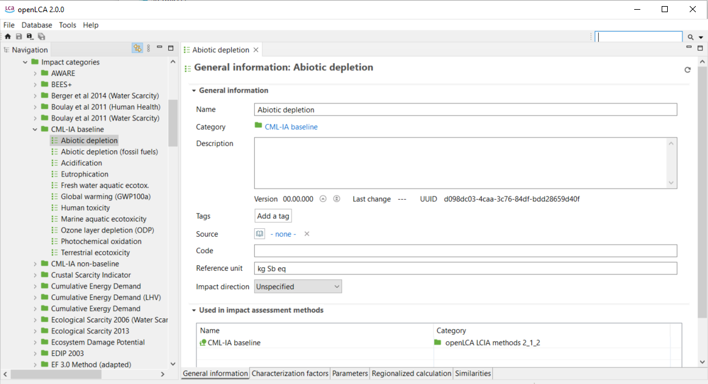

# _**New!**_ Impact assessment category tab contents

In openLCA 2, LCIA categories are now stand-alone entities that are stored outside of an LCIA
method. A single LCIA category can be used in several LCIA methods and an update
of such an LCIA category will update it in all LCIA methods where it is used.
The database update moves the LCIA categories to the new category "Environmental
indicators" in the navigation. 

>_**Note**_: As LCIA categories in different LCIA methods
often have the same name, there are also LCIA categories with the same name in
this folder. This can be easily changed by giving these LCIA
categories more descriptive names.

  
_LCIA category - General information tab_

The contents of the impact categories window will be explained in the following sections.

- [General information](./impcat_gen_info.md)
- [Characterization factors](./impcat_cfs.md)
- [Parameters](./impcat_parameters.md)
- [Regionalized calculation](./impcat_regionalized.md)
- [Similarities](./similarities.md)

