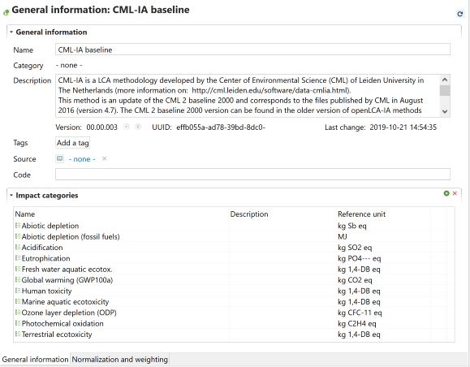
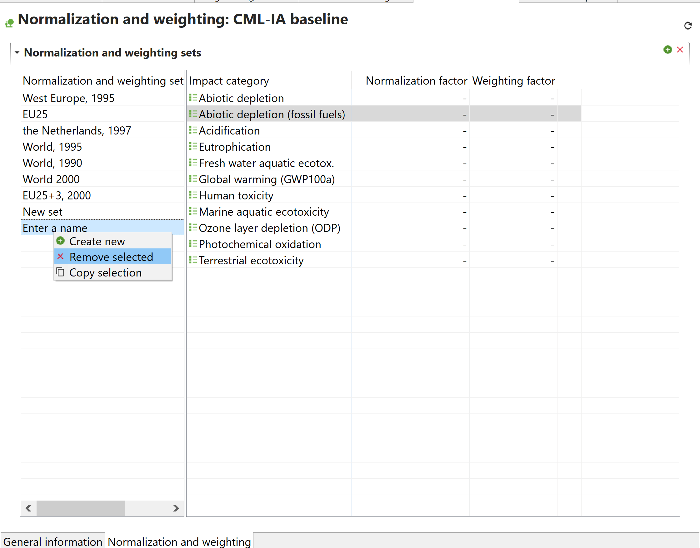

# Impact assessment methods tab contents

In openLCA versions from 1.x to the latest release, you could edit and create impact categories and factors within the impact assessment method tab. However, in version 2.0, this functionality has been separated, and now you can work with a distinct set of individual impact categories. You can edit their characterization factors, categories, flow properties, units, and uncertainty data in the "[Impact category tab](./impact_categories_tab_contents.md)".

<b> General information </b>

In this section you can:

Here you can view and modify the name of the methog, add a description, additional details or [tags](../cheat/tags.md), along with:

- Adding a source from the sources in the database. If unavailable, create a new source as described in "[Database elements](../databases/database_elements.md)".
- Adding a code (i.e., a short name for the category, useful in result views).

The image below shows an example of the General Information tab for the CML-IA baseline methodology from ecoinvent.

  
_LCIA methods - General information tab_

<b> Normalization/Weighting </b>

To add normalization and weighting factors to the impact categories of an LCIA
method:

1. Open in the "Normalization and weighting" tab. 
2. Click on the green "+" on the top right/double tap or right click on the empty cell under "Normalization and weighting set" to add a new set.
3. The impact categories saved in the method will automatically appear in the window on the right, where you can then manually type in normalization and weighting factors.

  
_Adding normalizing and weighting factors to impact categories_

