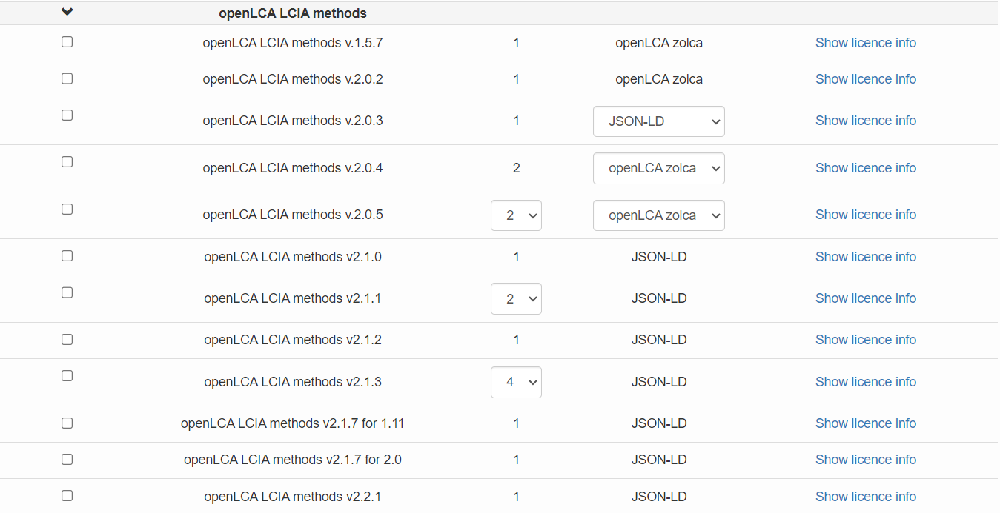
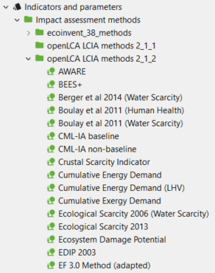
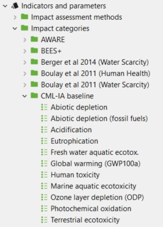

# Importing LCIA methods into openLCA

### Download LCIA methods from Nexus

[Nexus](https://nexus.openlca.org) databases do not always include LCIA methods, allowing users to select their preferred method. There is one overall LCIA method pack (the [openLCA LCIA methods pack](https://nexus.openlca.org/database/openLCA%20LCIA%20methods)) that we provide to be suited for many different databases (that also includes normalisation and weighting when the method provides them).

 

However, some databases require their own specific method pack. In Nexus, you'll find detailed information for every specific case. The table below provides information about the most commonly used databases available on [Nexus](http://www.openlca.org/download#methods). You can see if the database is compatible with the openLCA method pack and if a proprietary method is available to download. To learn how to download a database or method pack from openLCA Nexus, follow the instructions on [this section](../resources/nexus.md) of the manual. 

|              **Database**              | **Compatible with openLCA method pack** | **Proprietary method available** |
|:--------------------------------------:|:---------------------------------------:|:--------------------------------:|
| Ecoinvent                              | ✓                                       | ✓                                |
| Agribalyse v3.1                        | ✓                                       | ✗                                |
| Agri-footprint 6.3                     | ✓                                       | ✗                                |
| ESU World Food (unit and system)       | ✓                                       | ✗                                |
| EuGeos’ 15804_A2-IA  (unit and system) | ✓                                       | ✗                                |
| GaBi                                   | ✗                                       | ✓                                |
| ELCD                                   | ✗                                       | ✓                                |
| IO                                     | ✗                                       | ✓                                |
| ProBas                                 | ✗                                       | ✓                                |
| EN15804                                | ✗                                       | ✓                                |
| Ökobaudat                              | ✗                                       | ✓                                |

After downloading one or more of these method packs, you can import the  file into an active openLCA database. **Do not extract JSON-LD's .zip files before importing!**

>**_Note for macOS users:_** If you are using Safari, the browser will automatically unzip your downloaded zip files. However, you need the zipped file for import in openLCA (e.g., when you want to import JSON-LD, methods packages, ILCD...). You can solve this issue in three ways: 

1. Go to the settings of Safari and unselect the default option "Open "safe" files after downloading".

2. Use another browser for downloads, where the zip-files are not automatically unpacked after successful download.

3. Zip the archive again by using a third-party tool, because the build-in archive tool from Apple will add additional resources to the zip-file that can create issues when importing the file in openLCA.

### Importing LCIA methods into openLCA

To import a method pack, click on "Import" &#8594; "Others", then click on **"Linked Data (JSON-LD)"** and "Next". In the next window, browse for the file. The program will ask you how do you want to handle the import. You can:
1. **Never update a dataset that already exists**: The system will check for matching UUIDs. If a match is found, the existing dataset will remain as it is.
2. **Updated datasets with newer versions**: If matching UUIDs are found, the system will update the existing datasets only if the imported version is newer (the version can be checked in the "General information" tab of every dataset)
3. **Overwrite all existing datasets**: If matching UUIDs are found, the system will replace the existing datasets automatically with the imported ones irrespective of versioning. This is the option we recommend when importing an updated version of the [openLCA LCIA methods pack](https://nexus.openlca.org/database/openLCA%20LCIA%20methods).

Datasets with UUIDs that are not present in the current database will be imported anyway, regardless of the option you choose. 

Eventually, click on "Finish". 

The import will then start automatically and may take a few minutes. When it is finished, the LCIA methods will be available in the database, under "Indicators and parameters", as shown below.

    
_LCIA methods in openLCA_

>_**Note:**_ you can later assess the compatibility of LCIA methods with your database in  [LCIA checks](../res_analysis/analysis.md).

In openLCA 2, the impact categories are independent from the LCIA methods, and the LCIA methods are rather an "umbrella" which can contain several impact categories – this allows you to easily create own methods, e.g. for projects, by simply adding existing impact categories to e.g. a self-created LCIA method.

 
 _Individual impact categories_

