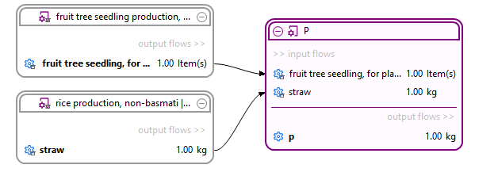

# _New_ Libaries in openLCA

Libraries are a new feature in openLCA 2.0. They are a tool that allows faster impact calculations and the use of processes, flows, 
impact categories etc. across databases. The **faster impact calculation results** arise from **precalculated matrices** (see section "[Library file system](./file_system.md)" for more information). Databases can be exported as libraries and inversely these libraries can be added to existing databases. 
The data from these imported libraries can then be used normally in the database for LCA modelling.
Additionally, libraries allow for a better overview when using the graphical editor, as some detail is hidden without compromising 
the accuracy of the impact calculations. 

 _Example of a library product system displayed in the graphical editor of openLCA 2.0_

Another advantage of using libraries is more efficient data exchange using the openLCA [Collaboration Server](<https://manuals.openlca.org/lca-collaboration-server/>), as library data is transferred only once and can then be referenced by multiple databases, rather than being transferred separately for each database.

