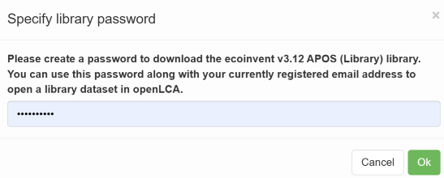
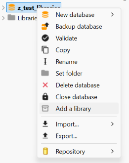
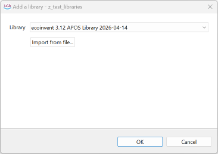
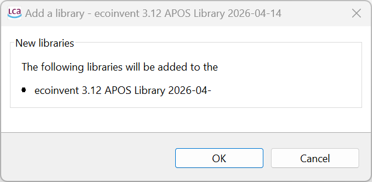
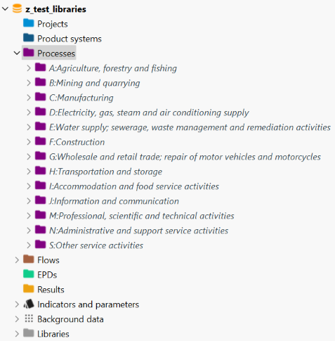
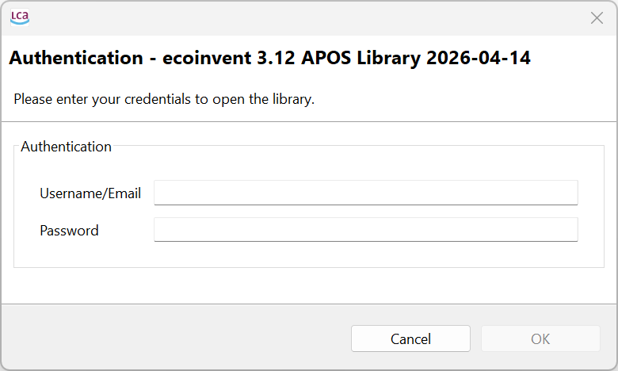

## Adding libraries into openLCA

    
Libraries can be downloaded from the openLCA Nexus and then added to an existing database. Initially, you have login into openLCA Nexus and choose the respective library. 

The moment you accept the license agreement, the EULA and hit "Download" another window will appear asking you to set a password for the library:

After entering the password, the download starts. Once finished, you can import the library into an empty openLCA database (or alternatively to an  existing database):

To do so: 
1.	right-click on the database you wish to add a library to 
2.	select "Add a library". 

    
     _Right-click menu data appears in openLCA >2.0 when you click on an existing database_

A window will appear in which you can select what library you wish to import into the database. 
The drop-down menu allows you to choose one of the openLCA libraries. If you wish to import an external library, 
you can do so by clicking on the button "Import from file …". 
This will open a conventional explorer window from which you can import a zip-formatted library file.
For more information about zip-formatted library files, read the section "[Library file system](./file_system.md)".

 _The dialog box that will open when selecting to add a library to a database in openLCA 2.0. 
A drop-down menu allows one to select from the set of libraries saved._

Before finalizing the library import into the database, you will be asked if you wish to really add the library to the database.
Simply press enter to proceed. 

Once added to the database, the processes, flows etc. will be available in the database. You can recognize everything that was added from the library by its cursive font.

 _Example of a library that was added to a database in openLCA 2.0_

If you open a library-derived process, you will have to activate the library using your email and the set password.

>**_Note:_** Once you open a process, be aware that you will be unable to alter the amounts of the inputs or outputs. 
If you wish to do so, you will need to copy the process in question and make your alterations to the copy. In every other respect, however, you can use processes, flows etc. from libraries just as you would with those native to the database.

