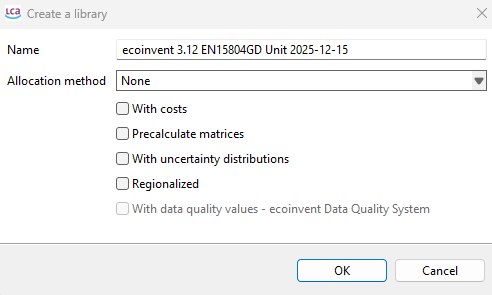
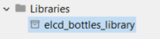
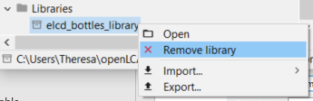

# Exporting a database as a library

To export a database as a library, open the database you wish to export. In the menu bar of openLCA go to "Tools" -> "Libraries" -> "Export (experimental)".

 _Menu bar in openLCA 2.6 to carry out a library export_

>**__Note:__** The sign ‘(experimental)’ means that the feature is a work in progress at the latest version and hence not fully functional.

A window will appear in which you can choose the name of your library as well as the allocation method. The window includes four additional options:

1.	**With costs** – includes the costs and revenues present in the database in the library.
2.	**Precalculate matrices** – performs a full matrix inversion. This requires extensive memory and computation time. In addition, results are slightly more accurate when the inversion is not performed, so this option is not recommended for unit process libraries such as ecoinvent. However, for databases with a matrix structure, such as PSILCA, it is more appropriate to enable this option.
3.	**With uncertainty distributions** – includes uncertainty distributions, if available, as defined per flow.
4.	**Regionalized** – includes regionalized calculations, applicable when the database already contains regionalized flows (i.e., flows associated with specific locations).

>**__Note:__** enabling precalculated matrices, regionalization, and uncertainty distributions may significantly increase memory usage. Once all settings have been selected as desired, click “OK” to create the library.

 _A dialog box which appears in openLCA 2.0 when exporting a database as a library_

At the bottom of the Navigation bar, a Library folder icon will appear, which is where you will find all libraries 
you have created saved. 

 _Examples of libraries in openLCA 2.0 that were created from existing databases_

If you wish to delete a library, you can do so by right-clicking on the library you wish to remove and select "Remove library".
Make sure the library is not being used in any of your databases, since openLCA with check if the library is being used and not 
let you delete the library if it is in use. 

 _Right-click menu data appears when clicking on a library in openLCA 2_

