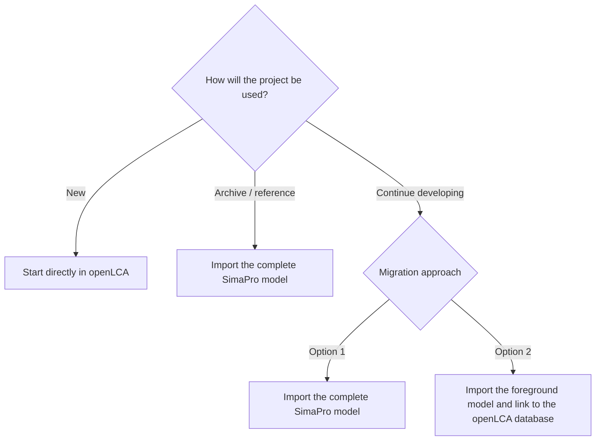
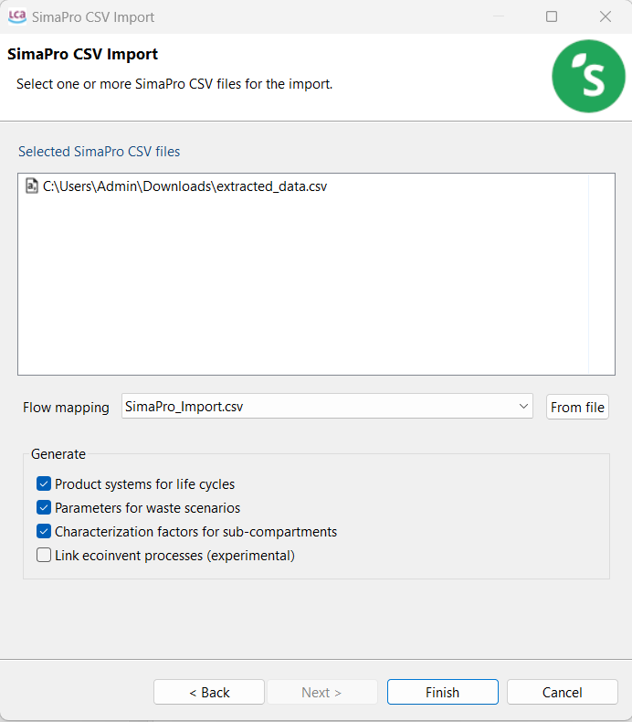

<div style='text-align: justify;'>

# How to migrate to openLCA from other tools


Many users come to openLCA with existing models developed in other LCA software or data stored in different formats. openLCA supports most common LCA data exchange formats, including JSON-LD, SimaPro CSV, EcoSpold1, ILCD, and Excel, allowing users to migrate existing work without rebuilding their models from scratch.
Technical details of the supported import formats are provided in the official openLCA manual chapter [Importing data and combining databases](https://github.com/GreenDelta/openLCA2-manual/blob/main/src/databases/importing_and_combining_databases.md).
This chapter focuses on selecting an appropriate migration strategy based on the intended use of the project and identifying the checks needed to ensure reliable results after migration.

The following general principles apply:

- Determine whether the project is **old/archived**, **ongoing**, or **new**.
- Decide whether to migrate the complete model, including background databases, or only the foreground model (then connecting to a background database on openLCA).
- Use mapping files where necessary to align elementary flows with the reference flow system of the target database in openLCA.
- Validate the migrated database and check LCIA coverage.
- Compare selected results with those obtained in the source software.


Note: If you already have an active license for the official database you are using, you can transform it for a small fee to the openLCA version 

The individual import formats and their technical details should be handled according to the corresponding [openLCA database import documentation](https://github.com/GreenDelta/openLCA2-manual/blob/main/src/databases/importing_and_combining_databases.md).
openLCA supports most common LCA data exchange formats and provides extensive functionality for importing, exporting, and working with LCA models. Its advanced, freely available development and scripting capabilities also make it possible to implement additional import/export formats and reproduce specialised workflows from other software.
Users with specific migration requirements or compatibility issues are encouraged to contact the software developers for guidance and support.

# Migrating from SimaPro to openLCA

## Choosing a migration path

Before migrating a project, classify it according to how it will be used in the future.

### New projects

For new projects, start directly in openLCA and use an appropriate database from openLCA Nexus [openLCA Nexus](https://nexus.openlca.org/).
> **Principle:** New modelling should be done in openLCA rather than starting a new project in another software and subsequently migrating it.

### Old / archived projects

**Use case:** Projects that should be retained for reference only.

**Recommended approach:** Import the **complete model**, including its background databases/libraries, as-is.
This preserves the original model structure, elementary-flow reference system, and existing LCIA methods. It can also be the fastest approach when a project uses several background databases besides ecoinvent.

_Note: The database might be not comptabile wit other databases in openLCA but is usable as a standalone database_

### Ongoing projects

For projects that will continue to be developed, there are two possible approaches:

- **Option 1:** Import the complete model, including its libraries/background databases.
- **Option 2:** Import only the foreground model and connect it to the corresponding openLCA background database.

For models based on **ecoinvent**, as this is the most commonly migrated database, moving the foreground model, is the preferred workflow when the intention is to use the openLCA version of ecoinvent and the openLCA LCIA methods.

See below [Import the complete SimaPro model with a SimaPro CSV import](#option-1-import-the-complete-simapro-model-with-a-simapro-csv-import) and [Import the foreground model and link it to openLCA ecoinvent](#option-2-import-the-foreground-model-and-link-to-openlca-ecoinvent).



## Option 1: Import the complete SimaPro model with a SimaPro CSV import

Export the SimaPro project together with its libraries/background databases, such as ecoinvent or other databases, and import the datasets into [a new empty database created from scratch in openLCA](https://github.com/GreenDelta/openLCA2-manual/blob/main/src/databases/creating_database.md).

### This approach is useful when:

- the project is old/archive and only needs to be retained for reference
- the SimaPro model structure needs to be preserved
- several background databases are used
- the existing SimaPro elementary-flow reference system and LCIA methods need to remain available

### What is preserved

- the SimaPro model structure
- parameters and other general features from SimaPro 
- the SimaPro elementary-flow reference system
- the LCIA methods from SimaPro
- the limitations of the SimaPro database structure, including lack of data-quality



### Mapping files

- A mapping file is **not required** if the imported model will use only the SimaPro databases and LCIA methods.
- If openLCA Nexus LCIA methods are to be used, a mapping file is required to map SimaPro elementary flows to the corresponding openLCA reference flows. See [Using mapping files in openLCA](https://github.com/GreenDelta/openLCA2-manual/blob/main/src/databases/mapping_validation.md).

### Importing multiple CSV files

If several SimaPro CSV files are imported without a mapping file, import them together in one step so that flows shared between the files can be matched consistently. See [SimaPro CSV import](https://github.com/GreenDelta/openLCA2-manual/blob/main/src/databases/importing_and_combining_databases.md#simapro-csv).

## Option 2: Import the foreground model and link to openLCA ecoinvent

Export only the user's own project from SimaPro, without its libraries, and connect the foreground model to the corresponding ecoinvent database in openLCA.

When to use this option?

- to use the openLCA version of ecoinvent
- to use the corresponding ecoinvent LCIA methods
- to allow the migrated model to use openLCA functionality and database structures.

For ecoinvent-based models, this is the recommended workflow for ongoing modelling. Other databases can also be migrated in a similar manner with support from GreenDelta.

### Export of the foreground model from SimaPro

To migrate only the foreground model, export the project as a SimaPro CSV file.

**Include:**
- project/foreground data.

**Do not include:**
- SimaPro libraries/background databases.

### Prepare the openLCA database

Obtain from openLCA Nexus the ecoinvent database matching the:

- ecoinvent version;
- system model;
- process type/model used in SimaPro.

For example, ecoinvent 3.12 cut-off unit-process database with its LCIA methods.

The ecoinvent database can be used either:

- as a regular openLCA database downloaded as a `.zolca` file and [imported into openLCA](https://github.com/GreenDelta/openLCA2-manual/blob/main/src/databases/importing_and_combining_databases.md); or
- as a library. See [Adding a library to a database](https://github.com/GreenDelta/openLCA2-manual/blob/main/src/libraries/adding_library_database.md).

### Import and link the foreground model

In openLCA:

1. Activate the target ecoinvent database.
2. Go to **File → Import → Other → SimaPro CSV**.
3. Select the exported SimaPro CSV file.
4. Enable **Link ecoinvent processes (experimental)**.
5. Click **Finish**.

During import, openLCA identifies the ecoinvent processes used by the foreground model from their names.

_Note: No copies of the ecoinvent processes or flows are created when the link is successful; only the foreground model is added to the database._


### Parameters

Parameters are migrated as follows. See the openLCA manual chapter on [Parameters](https://github.com/GreenDelta/openLCA2-manual/blob/main/src/parameters/README.md) for details.

| SimaPro | openLCA |
|---|---|
| Process parameters | Process parameters |
| Project parameters | Global parameters |

### Experimental feature

The **Link ecoinvent processes** option is experimental and is being actively improved.
In larger models, some naming patterns may not yet be recognized. In such cases, openLCA may create a copy of an ecoinvent process instead of creating a link.
Affected processes should be documented and reported so that the linking feature can be improved.


## LCIA methods

When the foreground model is linked to the openLCA ecoinvent database, the model uses the LCIA methods supplied with that ecoinvent database directly. See [LCIA methods and categories](https://github.com/GreenDelta/openLCA2-manual/blob/main/src/lcia_methods/README.md).
Therefore:

- SimaPro LCIA methods do not need to be imported;
- the ecoinvent/openLCA LCIA methods can be used directly.

### Checking result differences

Results may differ slightly from SimaPro.
A useful check is to compare the results of selected background processes with the official ecoinvent LCIA results. If the background results agree, this provides evidence that the corresponding methods are suitable for assessing the migrated foreground model.


## Elementary flows in the foreground model

Elementary flows added directly to foreground processes, such as direct emissions, are imported as SimaPro flows.
These flows are **not part of the openLCA reference system** and therefore may not be characterized by the openLCA/eecoinvent LCIA methods.

### Ways to resolve the issue

#### Option A — Use a mapping file

Use a mapping file during import to map SimaPro elementary flows to openLCA reference flows. See [Using mapping files in openLCA](https://github.com/GreenDelta/openLCA2-manual/blob/main/src/databases/mapping_validation.md).
Another mapping file is to be used when exporting the database back to SimaPro.

#### Option B — Bulk-replace the flows

If only a small number of elementary flows are affected, use **Tools → Bulk-replace** to replace the imported SimaPro flows with their openLCA counterparts.

#### Option C — Add characterization factors

Alternatively, add the relevant flows to the LCIA methods by adding characterization factors for them to the appropriate impact categories. See [Creating a new impact assessment method, category and characterization factor](https://github.com/GreenDelta/openLCA2-manual/blob/main/src/lcia_methods/creating_new_impact_assessment_method.md).


## Default providers

When the foreground model is connected to ecoinvent manually, without the **Link ecoinvent processes** option, product inputs may not have a default provider.
A Jython script can be used in the openLCA Python editor to set the default provider for exchanges whose product flow has a provider in the database. See [Scripting in openLCA](https://github.com/GreenDelta/openLCA2-manual/blob/main/src/scripting/README.md).
The script below works correctly only for flows with **exactly one provider** in the database.
If several processes produce the same flow, the script simply selects one of them.

```python
print("collect providers from database")
providers = {}
for tech_flow in TechIndex.of(db):
    providers[tech_flow.flow().id] = tech_flow

print("set default providers in exchanges")
sql = "select f_flow, is_input, f_default_provider from tbl_exchanges"
count = 0

def update_rows_fn(r):
    global count
    provider = providers.get(r.getLong(1))
    if provider is None:
        return True
    is_input = r.getBoolean(2)
    if is_input != provider.isWaste():
        r.updateLong(3, provider.providerId())
        r.updateRow()
        count += 1
        if count % 500 == 0:
            print("updated %d providers" % count)
    return True

NativeSql.on(db).updateRows(sql, update_rows_fn)
print("all done")
```


## Checking the migrated model

Regardless of which migration option is used, users are advised to validate the model after migration.

### Validate the database

Right-click the database and select **Validate**. See [Using mapping files and validating databases](https://github.com/GreenDelta/openLCA2-manual/blob/main/src/databases/mapping_validation.md).

Check for:

- broken links;
- missing references;
- other database errors.

### Check LCIA coverage

- After calculating a result, inspect the **LCIA checks** tab. See [LCIA checks](https://github.com/GreenDelta/openLCA2-manual/blob/main/src/res_analysis/res_lcia_checks.md).
- This identifies flows that are not characterized by the selected LCIA method.
- Uncharacterized flows often indicate that elementary flows still need to be mapped or replaced. Unless it is a specifically uncharacterized elementary flow represented for informative purposes.

### Compare results with SimaPro

- Compare several key product systems between SimaPro and openLCA.
- Investigate any differences rather than assuming that the migrated model is equivalent.
- For ecoinvent-based models, comparison against official ecoinvent LCIA results for background processes is also useful.


## Exporting back to SimaPro

Models in openLCA can be exported as SimaPro CSV files for use in SimaPro. See [Exporting databases](https://github.com/GreenDelta/openLCA2-manual/blob/main/src/databases/exporting_databases.md).
If a mapping file was used during the import, the reverse mapping needs to be applied when exporting back to SimaPro.

_Note: More advanced openLCA-specific features or specific SimaPro workflows may not be exportable without additional scripting with our free developer tools and API. Please contact GreenDelta directly if you need support with this._


</div>