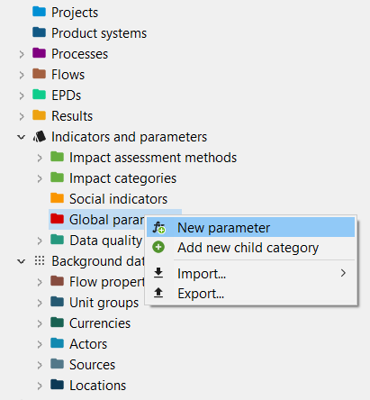

# Parameters

Parameters can be used on the process, Impact assessment method, product system, project and database levels. Parameters display variables instead of concrete values used in the inputs or outputs. They can be defined as simple values, formulas or complex functions. Parameters can overwrite each other (e.g. the value set for a parameter in a process can be overwritten on the product system/project levels).

In practice, parameters facilitate sensitivity analyses to estimate how much the modification of any certain aspect of the model will impact the outcome of a study. Parameters are also useful when working with preliminary data that is subject to change or for the creation of different versions of the same system while changing certain input/output values.

  
_Adding parameters in openLCA_

