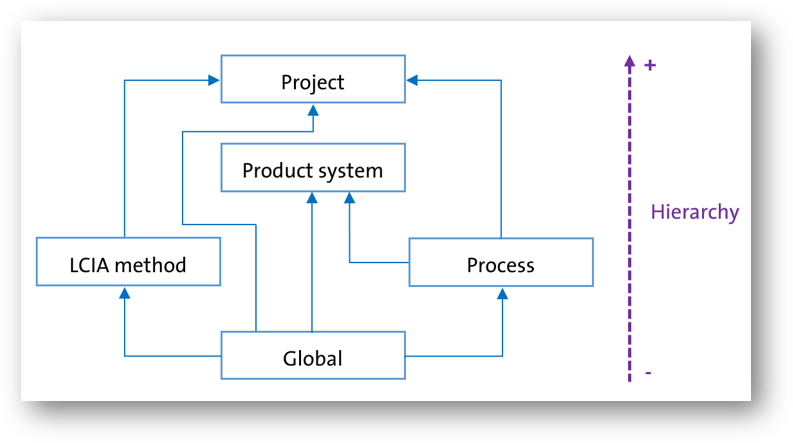

## Parameter hierarchy

If the same parameter has different values at different levels, the system's hierarchy determines which parameter value takes precedence in calculations. The parameter values at the highest hierarchy (+) overwrite the value at the lower level (-).

An illustration of the parameter hierarchy can be seen below. 

For example, if a process has the same name as a global parameter 'x', then within that process, the parameter will have the process parameter value. While in another process if 'x' is used, it will have the value of the global parameter.

  
_Hierarchy of parameters in openLCA_

