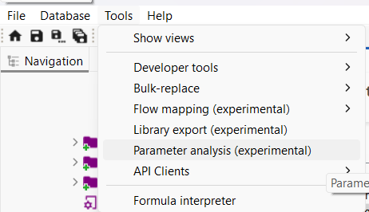
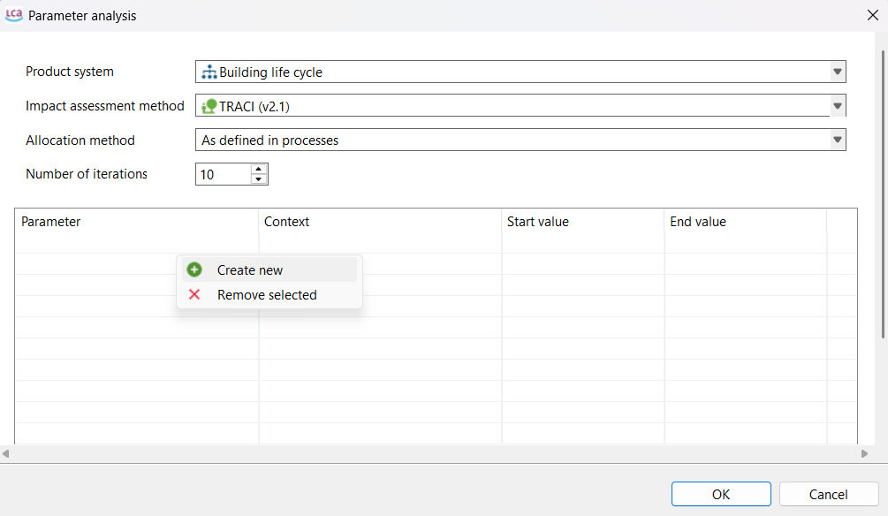
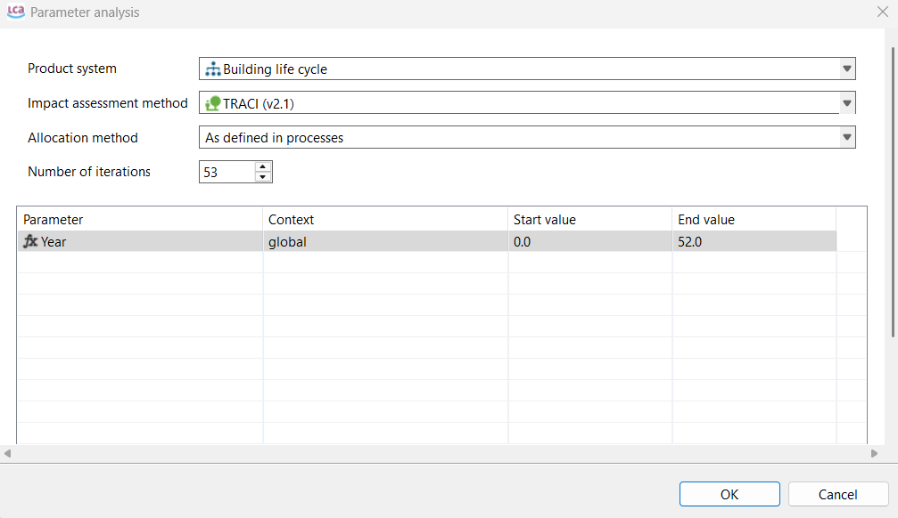
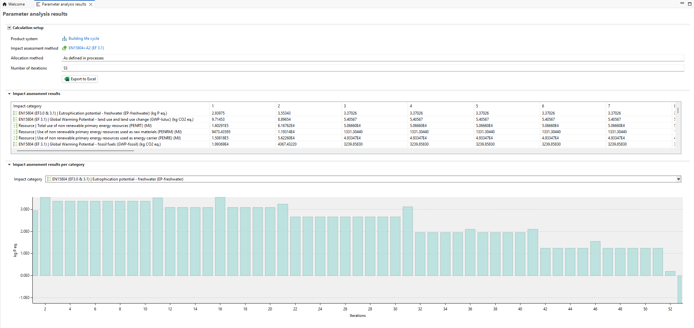

# Parameter analysis

Under **Tools → Parameter analysis** is a feature that allows you to change given parameter variable(s) across different iterations.

To do so, first, you must define a global parameter that is also used in your process(es). Next, you must create a product system based on that process. Then, when you go to *Parameter analysis*, as shown above, a pop-up window will appear. 

Then you should select the product system, impact method, and so on. Next, set the number of iterations (runs) you wish to perform. In the space below, you should right-click and select *Create new* to add the parameter they want to change in each iteration.

The parameter will appear in the table below. You must then set the start and end values, which will be divided equally across the specified number of iterations. Finally, you can click OK to run the iterations.

The results will then appear in a table format for each impact category of the selected impact method. You can export the results by clicking Export to Excel at the top.

You can check this topic in details in [Modelling with time paramenter section](../advanced_top/time.md)

