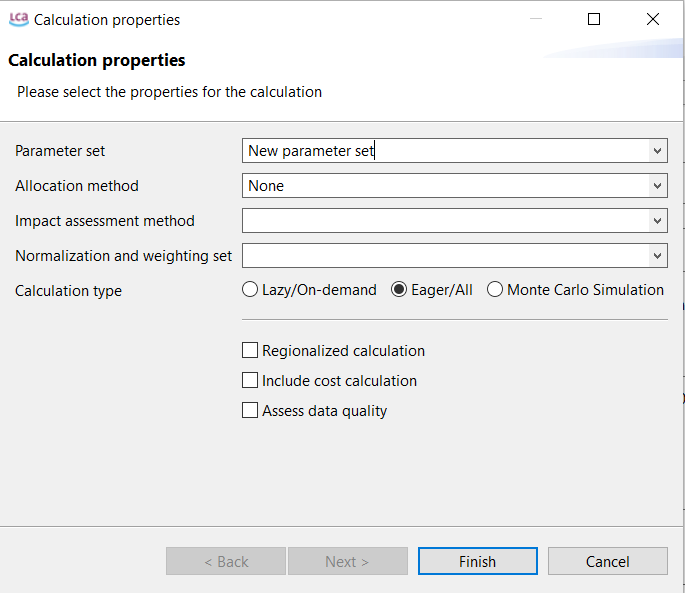
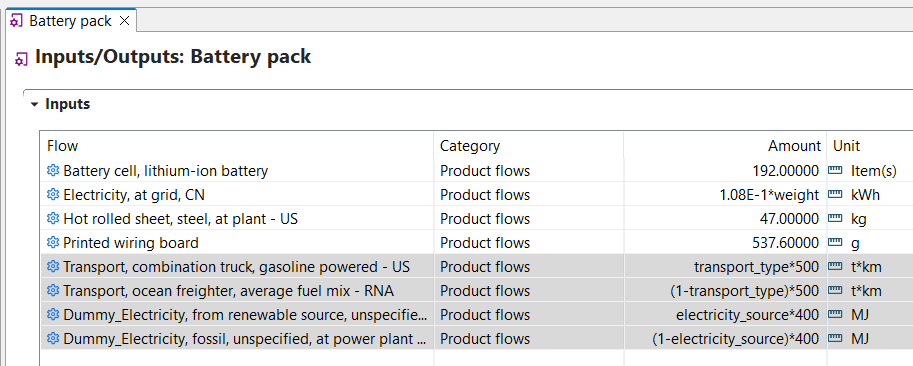

# Parameter sets

Compared to the previous version of openLCA, in openLCA 2 it is now possible to add so called "parameter sets", that allow the user to easily switch between parameter scenarios. When you create parameter sets, a new input field is added to the calculation properties popup window of the product system. This field then allows you to select which specific parameter set should be used for the calculations.     

 _Product system - Calculation properties - New parameter set_

In this example, we show the use of parameters and parameter sets to simulate various scenarios. The process Battery pack does include two types of electricity sources and two types of transportation. The parameters "transport_type" and "electricity_source" are both set to 1, which means the transport by truck and the electricity from renewable sources will be used to calculate the Battery pack impacts (see "Amount" column 1-parameter).

_Product system - Parameter use_

However, in the "Parameters" tab in the Battery Pack product system, you can switch between the different transport and electricity types by creating parameter sets. See the example given in the following figure. 

_Product system - Choosing a parameter set_

