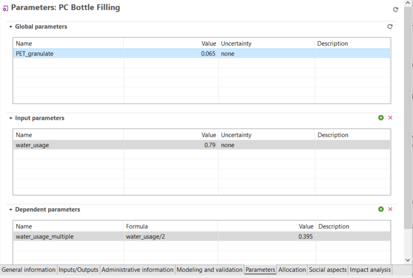
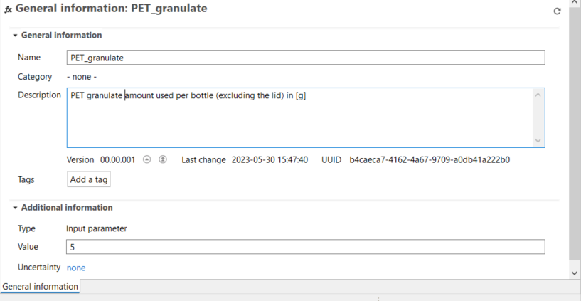
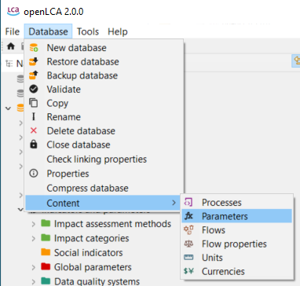
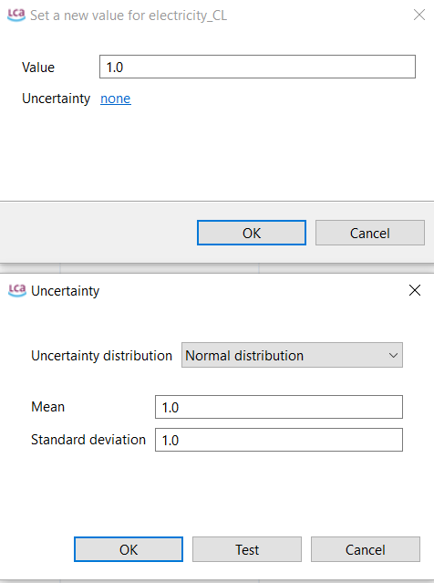
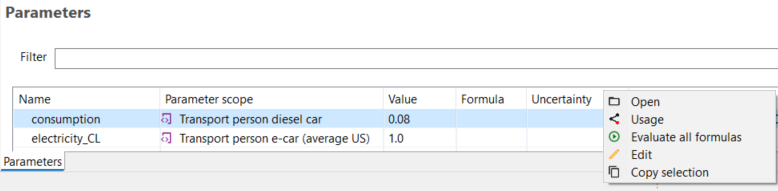
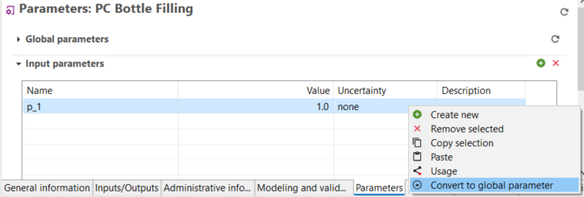

## Types of parameters

In openLCA you can find three types of parameters:

- "Global" parameters can be found and are valid on all levels. 
- "Input" parameters are parameters that are only valid for the process/LCIA method/Product system in which they are saved. 
- "Dependent" parameters are parameters that include input or global parameters in their formula. The figure below illustrates the view on openLCA for an example.

**_New!_** Global, input and dependent parameters can be created within a process or impact assessment method. These are then also available in product systems and projects in which the process or impact assessment method is used. It is not possible to create a new parameter on the product system or project level.

  
_Global, Input and Dependent parameters (reload button for global parameters and add parameter button highlighted)_

### Create a parameter

To create a **Global parameter**: 

 1. Right-click on "Global parameters" in the "Indicators and Parameters" section in the Navigation panel.
 2.	select "New parameter". 
 3. Enter the name (see rules below), description (optional), type (input or dependent parameter) and amount, then click on "Finish". 

  
_Creation of a global parameter_

4. After creating a global parameter, a general information window will open up in the Editor, and you can add tags and uncertainty (**_new!_**).

5. To load in a process the global parameter you’ve created, select the "reload" button in the "Global parameters" section in the "Parameters" tab in a process or impact assessment method.

  
_Global parameter - general information_

6. The global parameters can also be viewed and edited by clicking on "Parameters" under "Database" &#8594; "Content". This opens up the window below which as a (**_new!_**) feature allows editing of uncertainty by double-clicking in the "Uncertainty cell".

 _View and edit Parameters under Database &#8594; Content_

To create an **Input and Dependent parameter**:

1. Open the "Parameters" tab of an open process.
2. Select the "+" at the top right-hand corner of the input/dependent parameters section.
3. Assign a name, value, uncertainty (for an input parameter) and description.
4. In case of a dependent parameter, a formula can be used to link it to the parameters it is dependent on. To write a correct formula, you can check the accepted constants, operators and functions in this [chapter](../advanced_top/formulas_in_openlca.md).

**_Note:_** An input/dependent parameter can be converted into a global parameter by right clicking on it and selecting "convert to global parameter" (**_new!_**).

_Conversion of an input/dependent parameter into a global parameter_

The _use of parameters_ within a database can be checked via the "usage view" feature (right-click on a parameter and select "usage").

_**Note:**_ Use the **formula interpreter** ("Tools" section in "[Running openLCA for the first time](../welcome_to_openLCA.md)") to check the functions you want to include in dependent parameters.

### Parameters Rules

- **Parameter names**:
  - Must be one word, underscores (`_`) are allowed.
  - Cannot contain special characters.
  - Cannot have more than 255 characters.

- **Parameter formulas**:
  - Can contain single values, simple equations, or complex functions including logical expressions ("[Constants, operators and functions for formulas in openLCA](../advanced_top/formulas_in_openlca.md)")
  - Do not contain units, so please add them in the comment field.
  - Cannot have more than 255 characters.

- The amount of parameters is, theoretically, not limited.

- Use a point (`.`) instead of a comma (`,`) for decimal numbers.

### New features in openLCA 2

- When you edit a parameter name or value, it will now be automatically updated throughout the database, e.g. if the parameter is used in a formula of a dependent parameter, it will automatically change. 

- Parameter sets: create some parameters, assign values meant for different scenarios and then save those scenarios and choose them within the same product system. An example is provided in the parameter section of the section [Product systems](../prod_sys/index.html). 

