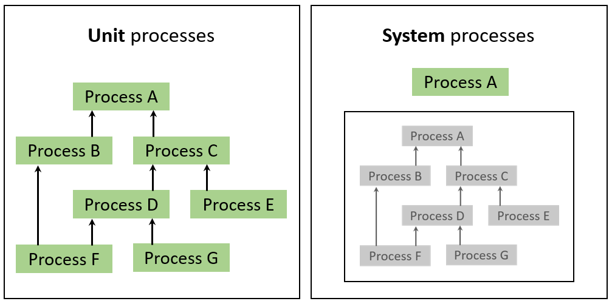
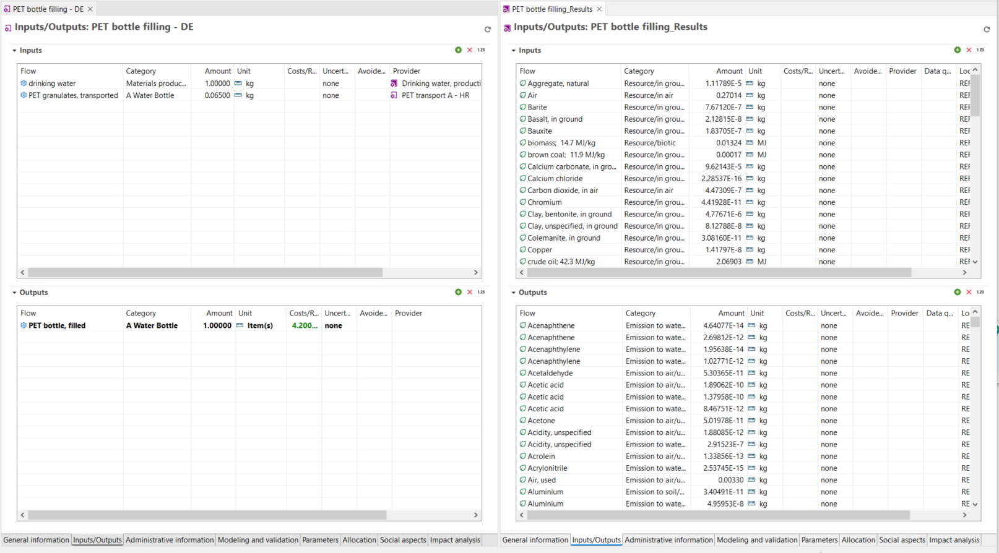
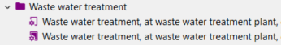
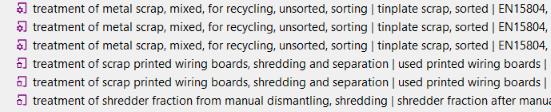

# Processes

A process is a set of interrelated activities that takes place within the life cycle of a product or system, and transforms inputs into outputs. A process can be a manufacturing process, a transportation activity, an energy generation process, or any other operation within the life cycle. Processes are defined by their quantitative reference, which represents the amount of product or service that the process provides. For example, a process could be the set of all inputs and outputs occurring in the production of 1 kg of PET granulate.

openLCA distinguishes two types of processes:

- **Unit process:** A unit process is the smallest (least aggregated) unit in a production system, for which input and output data are quantified. It can contain any flow type.
- **System process:** A system process is an aggregated life cycle result saved as a process.

The following picture shows the difference between a unit process (left) and a system process (right). In the left picture, each process from A to G is a unit process. In the right picture, instead, is shown an aggregated process (system process).

  
_Difference between unit process and system process_

The following picture shows the difference between a unit process (left) and a system process (right) in openLCA. 

  
_Difference between unit process (left) and system process (right) in openLCA_

Unit processes and system processes are displayed with different icons in the navigation window as shown below.

  
_Unit processes (purple font colour, empty background) and system processes (purple font
colour, filled background)_

Moreover, in openLCA we differentiate the icons between processes with product flows (gear) and waste flows (bin) as reference accordingly:

  
_Top three process are process with product flows as reference in contrast to the other three processes representing waste treatment_

