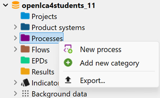
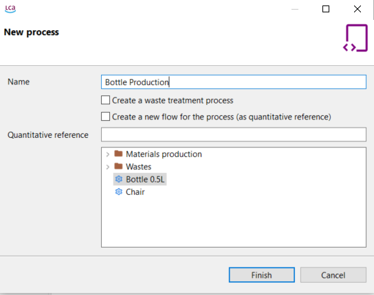

# Creating a new process

To create a new process, follow these steps:

1. Right-click on the "Processes" folder and select the option "New process" from the context menu.

  
_Step 1: Creating a new process_

2. Provide a name for the process and choose a quantitative reference for it by selecting an existing flow, or create a new flow by checking the corresponding box. If the flow is not named, it will automatically adopt the same name as the process.

  
_Step 2: Selecting a quantitative reference while creating a new process_

3. Click "Finish" to create the process, which will then open in the editor.

After creating a new process, the process window will open, allowing you to define and manage the properties of the process. 

It is also possible to create waste treatment processes. Check ["Waste modelling"](../waste_modelling.md) section for details.

