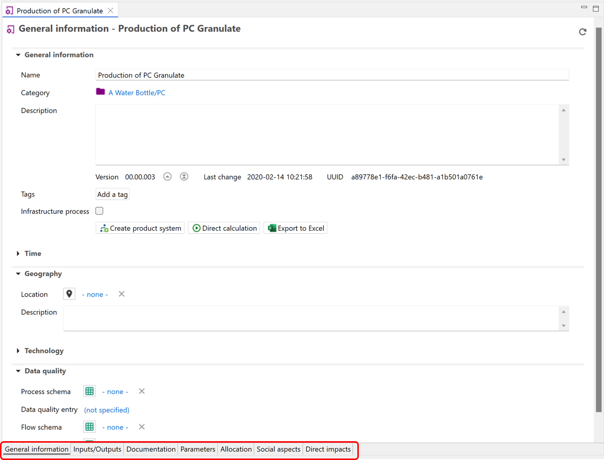

# Process tab content

After opening a process in openLCA, you will find tabs at the bottom of the window, that provide access to different information and settings relevant to the process.

  
_Tabs of the process window_

In the sub-chapters that follow we'll explore every tab in details.

- [General information](./tab_general_info.md)
- [Inputs/Outputs](./tab_inputs_outputs.md)
- [Documentation](./tab_documentation.md)
- [Parameters](./tab_parameters.md)
- [Allocation](./tab_allocation.md)
- [Social aspects](./tab_slca.md)
- [Direct impacts](./tab_direct_impacts.md)

