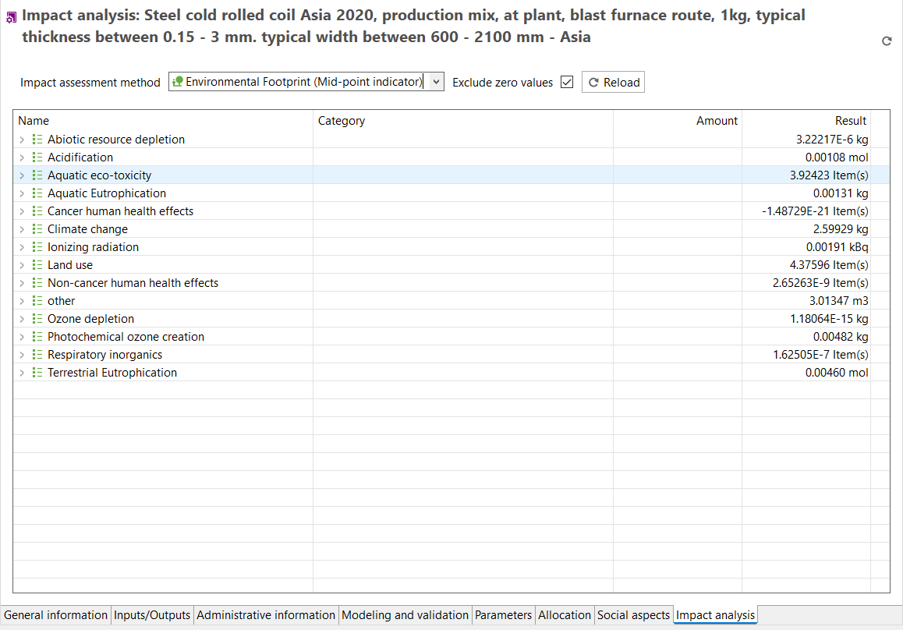

# Direct impacts

In the "Direct impacts" tab of a process, the process's direct impact is calculated. Hence, only elementary flows present in this process (no upstream impacts) will be considered. You can choose the impact assessment method directly within the tab and the results will dynamically update accordingly. This option is advantageous in "System Process" databases, e.g. GaBi, Environmental Footprint.

  
_Impact analysis of a process_

_**Note**_:  The "Direct impacts" tab only provides you with the impacts of this particular process. Hence, the overall impacts are displayed only in the case of using system processes. In case of using a unit process-based database, only the direct impacts (elementary flows used in this process) will be calculated using "[regionalized calculation](../advanced_top/regionalized.md)". To fastly calculate the **overall impacts** including the whole supply chain, check out the "[Direct calculation](../cheat/direct.md#direct-calculations-in-the-impact-analysis-tab)" section. 

To dive deeper into the subject of LCA calculations, you can explore the sections "[LCIA methods and categories](../lcia_methods/importing_lcia_methods.md)" and
"[Calculation and Result Analysis](../res_analysis/index.html)".

