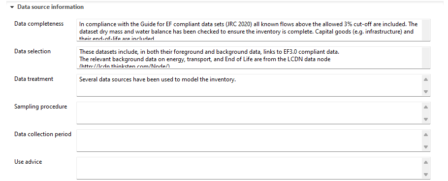
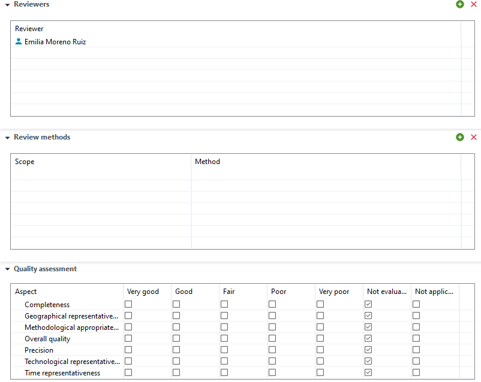
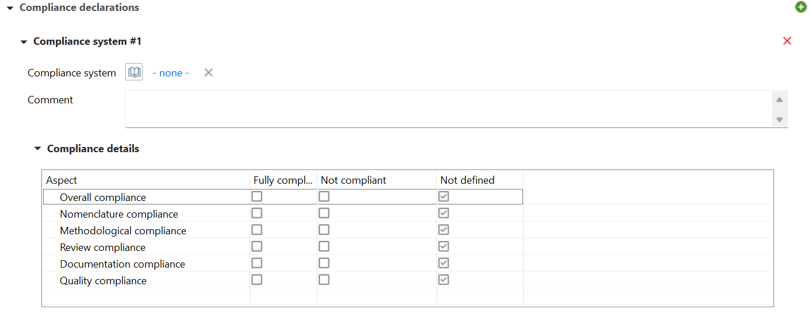

# Documentation tab

In the "documentation tab", former "modeling and validation" and "administrative information", you will find all details related to your process. It is devided into seven subsections:

- LCI method: 
	- Specify the process type, whether it is a unit or system process.
	- Describe the Life Cycle Inventory (LCI) method used.
	- Note any modeling constants utilized in the analysis.
- Data source information:
	- Provide information about data completeness.
	- Discuss the data selection process if relevant to your study.
	- Detail the data treatment methods applied.
	- Discuss the sampling procedure employed for data collection.
	- Define and document the data collection period.

 

- Reviews:
	- Define reviewers of the process and access their review reports. Moreover, details about the review method and qualtiy assessment are provided.
	
  

- Compliance declarations:
	- Define details about compliance
	
  

- Completeness:
	- Helps the user do identify the completeness of a process in logic with ISO14040
	
  

- Sources:
	- To add a data source, click on the green "+" icon in the "Sources" section. If the required source is not listed, you can add a new one by right-clicking on the "Sources" folder in the Navigation and selecting "New source."
	
  

- Administrative information:
	- The "Administrative Information" subsection is where you can input or find dataset-related details such as ownership, publication, access and use restrictions, and more. It's important to note that the entries in the administrative information section do not have any impact on the actual calculations.

  

The definitions of data set owner, data generator, and data documentation are not fixed. However, data owner can be the contacts of the person or entity who owns this dataset. A data generator can be an expert who compiled and modelled the data set as well as internal administrative information linked to the data generation activity. And the data documentor can be the contact of the responsible person or entity that has documented this data set, i.e., entered the data and the descriptive information. Some guidance is also provided in the ILCD handbook.

You can also include reviewers by clicking the blue "Add actors" icon within this section. If the actor you want to add isn't listed under "Actors," you can create a new one by right-clicking on the "Actor" folder in the Navigation panel and selecting "New actor."

  

**_Note_**: It's important to note that the entries in the modeling and validation section do not have any impact on the actual calculations.

