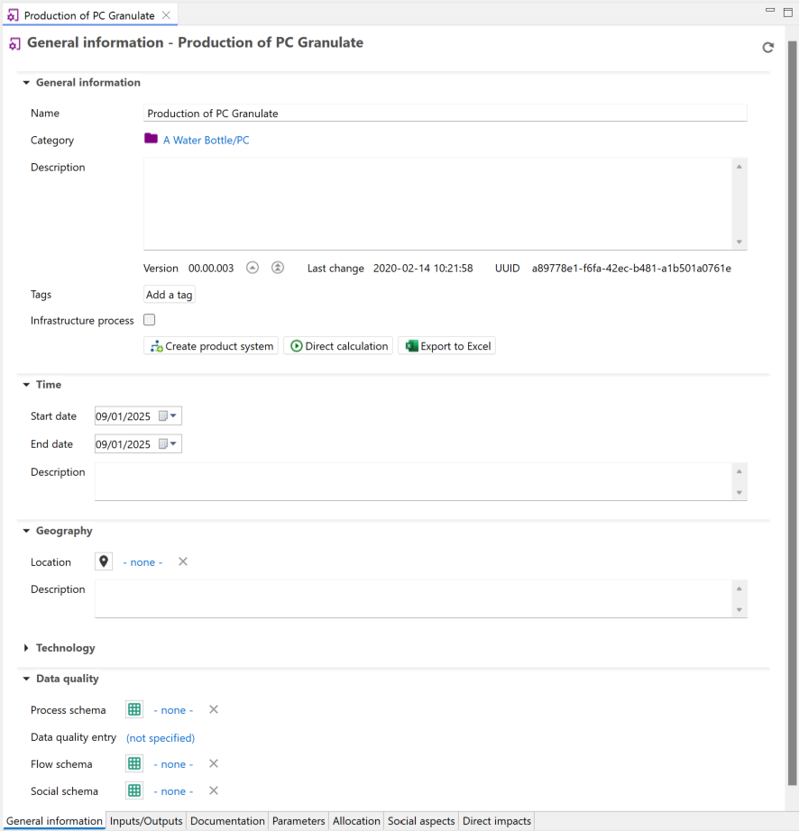

# General information

  
_General information tab of a process_

Here you can view and modify the name of the flow, add a description, additional details or [tags](../cheat/tags.md), create a [product system](../prod_sys/Creating.md) from the process and export the process tabs to an Excel file. Additionally:

**_Note on "infrastructure process":_** This checkbox serves to store whether a process is infrastructure process or not (so, the process is a product with long lifetime and costly – a building, a machinery, …). This is a mandatory field in the EcoSpold1 format and also used by SimaPro e.g.. In openLCA, it has no practical effect.

**Direct calculation:** The "Direct calculation" feature generates and then calculates an in-memory product system, connecting processes using default providers or the first found connection. Reproducible and correct results are only obtained if there are unambiguous connections between these processes, i.e. if either there is always only one producing process for a product, or there is always a default provider set, to make the connection to the providing process clear and unique. 

If you are unsure about the connections, check the linking properties of a database, either via "Database → Check linking properties" or via the "Check linking" option in the pop-up window after selecting "Direct calculation":

  
_Check linking prior calcuation_

The main advantage of "Direct calculation" is its lower memory usage. It bypasses the need to create a separate product system in advance. This is particularly practical when working with databases that create very large product systems such as PSILCA and exiobase.

## Time 
 
In the time section, you can add and edit the start and end time of the process as well as provide any relevant descriptions.
 
## Geography

In the Geography section, you can add and edit the location of the process. Clicking on the chosen location, you can also see it on a map. 

  
_Add a location to a process_
 
  
_View a location on a map_

## Technology 

In the Technology section, users have an add a description about the technology employed in the process.

## Data quality

Here you can define the data quality flow schema for your process on process and flow level.

  
_Options for data quality in a process_

 The process data quality will be filled in the "Data quality entry" whereas flow data quality will be filled in at the Inputs/Outputs tab next to the respective flows. Check [Data Quality](../advanced_top/data_quality.md) section for details. Further 

