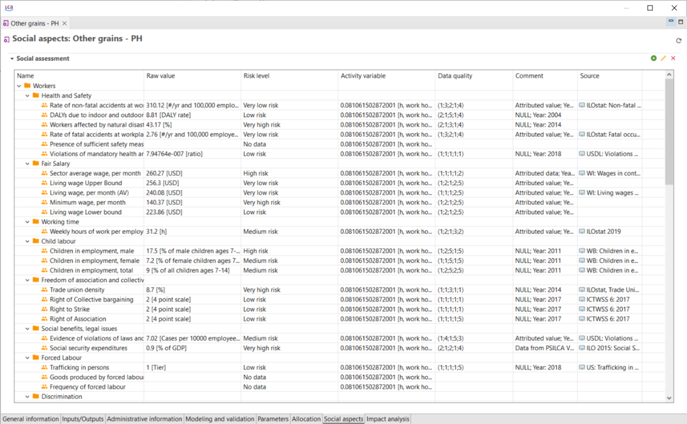

# Social aspects

Information regarding the social indicator according to a process can be viewed in the "Social Aspects" tab. Information on the raw values, risk level (evaluated according to the amount of the "raw value"), activity variable, data quality, comment and source can all be displayed. The risk-assessed indicators are characterised by the activity variable. For instance, for the time being, all indicators use working hours as an activity variable. To learn more about this and about each social indicator, it is recommended to visit the PSILICA manual, which is available on the Nexus website. This tab only shows values if you are using a database with social information (soca, PSILCA).

  

Check out the "[Social aspects](../advanced_top/social_aspects.md)" section. 

