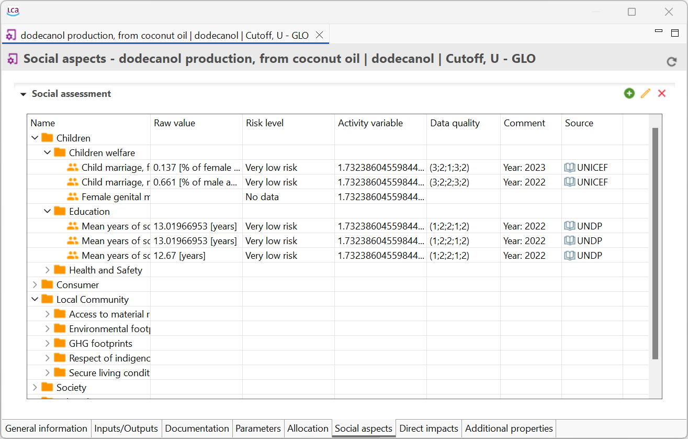

# Social aspects

In this tab you will find the social aspects of the process itself (without the supply chain) and further information such as data quality, reference year and source. It works in the social LCA databases such as soca or PSILCA.

_Social aspects tab_

Check out the "[Social aspects](../advanced_top/social_aspects.md)" section. 

