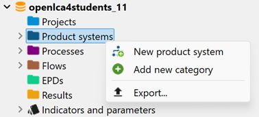

# Creating a new product system

In this section you can learn how to create a product system and specify its settings:

There are two ways to create a new product system in openLCA. You can use the navigation panel and then manually add the reference process, or you can create it directly from an open process, that will automatically be selected as reference process for the new product system. Both can also be used in combination, i.e. manually creating a part of the system and have the software then autocomplete the remaining supply chains. 

Autoconnecting processes allows you to create large systems, literally consisting of several thousand connected processes, fast; it is good if the connections are clear already from the database, either since there is only one possible connection (provider process) for each product, or since default providers are set, for the processes. Manual connection gives you full control over the connection, and is needed for databases like GaBi or EF, where connections are ambiguous.

### Creating a product system in the navigation panel

To create a product system from the navigation panel, right-click on the "Product systems" folder and select "New product system":

 _New product system_

### Creating a product system from a process

To create a product system directly from a selected process, go to the "General Information" tab of the process and select "Create product system":

 _Create product system_

### Product system settings

The "New product system" pop-up window will appear and you can use it to define the name of the product system and selects the reference process, the provider linking, the preferred process type, and the Cut-off option you prefer.

 _Product system creation window_

- **Reference process:** The reference process is the process that models the last step of your supply chain, or the last step of a specific chain. For example, the production of a battery pack may represent either the entire supply chain of interest, or an intermediate stage within the production model of an electric car. If you want to assess the potential impacts of the battery pack, the corresponding process "battery pack" is chosen as the reference flow. To add the reference process to a new product system that you are creating from the Navigation panel, you can type the name of the process into the "Reference process" field, or navigate through the process folders. If you are creating the product system directly from a process, that process will automatically be selected as the reference process.
					
- **Auto-linking:** To automatically have all upstream processes linked to the reference process, select "auto-link processes". Hereby, the auto-linking function connects input and output flows between processes. Using the auto-linking feature, you can save time and effort in manually linking processes within an LCA model. It helps ensure that the material and energy flows within your model are properly accounted for. If you don't select this option, no upstream processes will be taken into account! 

The following options are available upon selecting "auto-linking" option:

- **Check multi-provider links (experimental):** This option has just been added for your convenience and allows also to check for linkages to various providers (please check the "[Model graph](../prod_sys/model_graph.md)" tab later on).

- **Provider linking:** When creating a product system, openLCA can automatically check for flows with multiple providers. However, many processes from databases such as ecoinvent have preselected providers which are called "default providers". If openLCA detects a flow with multiple providers in a product system, you can choose how openLCA should handle this situation, choosing from three default provider options.

	

	
<b>Details on default providers</b>

	
	-   **Only link default providers**: openLCA will exclusively create links between processes that share input and output flows from the default providers.

	-   **Prefer default providers**: openLCA will give priority to creating connections using data from the default providers. However, if there are no default providers set, openLCA will consider other providers to establish connections.

	-   **Ignore default providers**: openLCA completely disregards the default providers during the auto-linking process. The first suitable process connection found will be used then in each case. 

	After creating a product system, it is possible to add and delete connections in theit is possible to add and delete connections in the ["Model graph"](../prod_sys/model_graph.md) tab.

- **Unit process or System process:** The next step is to choose whether to connect to a unit process or a system process if no provider is selected in the process. This setting only has an effect if default providers are not used or not specified, since the default provider is always one specific process, which is then already a unit or system process. The difference between a system and a unit process is described in the section "[Processes](../processes/index.html)".

- **Cut-off threshold:** It is possible to set a cut-off threshold for the **auto-connection** to reduce the complexity of your product system. Providers that contribute less than the threshold to the inventory are not connected (numerically cut off). This is applied throughout the whole (connected) supply chain! Elementary flows of the reference process are not affected! The function can be handy for databases with extensive process networks with minimal individual process contributions and consistent unit, for example multi-regional input-output databases, e.g. PSILCA. **Be aware that the cut-off is applied irrespective of the used unit and focuses solely on the numbers!** For this reason, it works best for databases where all products have the same unit, such as, again, multi-regional I/O databases (PSILCA).

**To finally create the product system, click "Finish"!**

