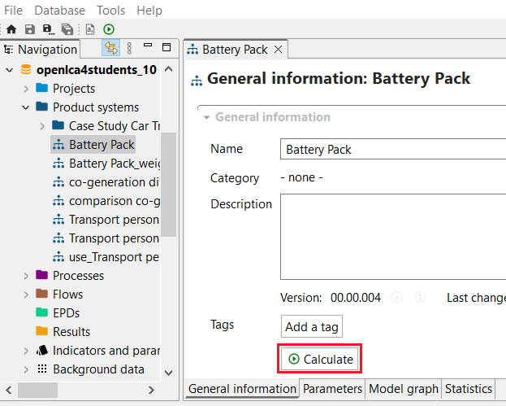

# Calculating a product system

There are three ways to access the calculations of the impact assessment of a product. You can right-click on a product system in the navigation panel and select "Calculate", click on the "Calculate" button in the "General information" tab of the product system, or click the on green "Calculate results" icon above the navigation panel.

_Calculating a product system_

Either way, a pop-up window will open and you can choose the calculation properties.

  
_Calculation properties_

The details on the calculation setup and the result analysis are described in the section [Calculation and Result Analysis](../res_analysis/index.html).

