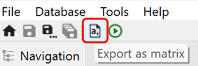
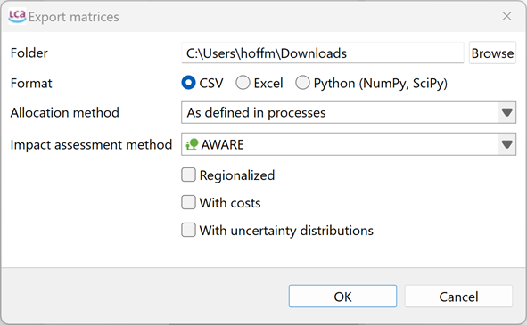
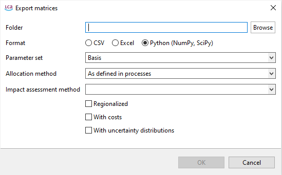

# Exporting product systems

In openLCA, you can export the selected product system by left clicking on 'Export as matrix' on the toolbar. 

This will show the following window:

From here you can choose: the folder where the product system is exported, the format you want it exported (CSV, Excel, Python), the used allocation method, the respective impact assessment method (present in that database), regionalization, cost calculation and uncertainty distribution. If you have created parameter sets for your product system, these can be selected using the drop down menu as in the picture below.

 _Esporting as matrix a product system with parameter sets_

