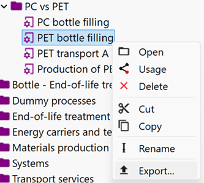

# Exporting/saving product systems

In openLCA, you can export your product system in different ways, according to your needs.

## Saving a product system as a system process

The first method for saving a product system is to calculate its Life Cycle Inventory and then save the results as a System Process. 

 _Save results as..._

 _Save results as system process_

 _LCI results saved as system process_

You can check the details in ["Save results"](../res_analysis/save_export.md#save-as-system-process) section.

## Export in JSON-LD format

Another option, very convenient for data exchange, is it to export the product system as a JSON-LD file. This feature is available for every elements of the database.

You can right-click on the product system you want to export and select "export":

On the window that will pop up, select "JSON-LD".

Afterwords, you can decide the name of your .zip file and where in your computer it's going to be saved. In the same window, you can check the elements that are going to be saved, adding or excluding some of them. When you're satisfied, click on "Finish".

You can now import the elements you exported in another database in openLCA, right-clicking on it and selecting "Import".

## Export as matrix

Eventually, you can export the product system as a matrix, by left clicking on 'Export as matrix' on the toolbar. 

This will show the following window:

From here you can choose: the folder where the product system is exported, the format you want it exported (CSV, Excel, Python), the used allocation method, the respective impact assessment method (present in that database), regionalization, cost calculation and uncertainty distribution. If you have created parameter sets for your product system, these can be selected using the drop down menu as in the picture below.

 _Esporting as matrix a product system with parameter sets_

