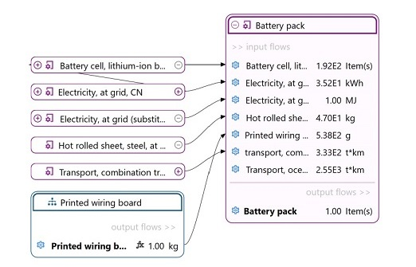
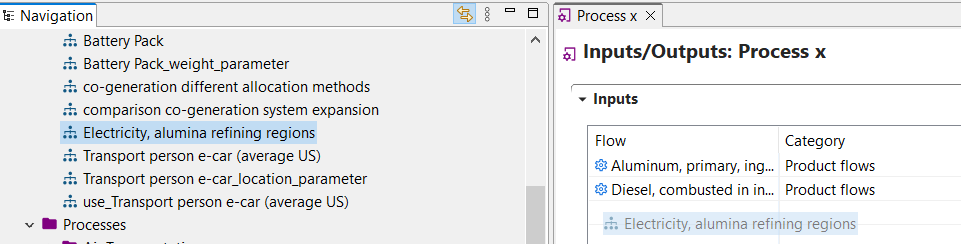

# Nested Product Systems

A product system can serve as the provider to another product system - the result is then a "nested" product system. For this, drag and drop a product system into the model graph of a different product system and connect it to one of the input flows via "search recipients for".

 _Nested product sysyems_

You will see the contributions of the sub-product system to the overall results, e.g. in the impact analysis and contribution tree results.

A product system can also be used as an input flow for a process. The quantitative reference flow of the product system will be added to the process.

  
_Drag-and-drop of a product system into the input flows of a process_

This is particularly helpful when working with EPDs. Check ["Using results of EPDs in the supply chain"](../epds/life_cycle_models.md) section for more details.

Details about nested product systems are available at this
[link](https://github.com/GreenDelta/olca-app/issues/72).

# Using results in product systems

As you will see (check ["Save and exports results chapter"](../res_analysis/save_export.md) section for details) you can now save your results and use them in different ways. Among them, once saved, you can drag results in a product system:

_Result dragged in a product system_

You can use this feature to complete the supply chain when the inventory is not known, if the method used is the same.
Is also particularly helpful when working with EPDs (check ["Using results of EPDs in the supply chain"](../epds/life_cycle_models.md) section for more details).

