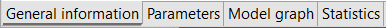

# Product System tabs contents

In the following we will describe each tab of a product system in openLCA:

<b>General information</b>

The general information tab is split into "General information" and "Reference". 

_Product system - General information tab_
	
- _**General Information:**_ Here you can change the name of the product system and optionally add a description. Below the "[Add a tag](../cheat/tags.md)", button, the "Calculate" button starts the impact calculations (you can achieve the same clicking on the green "Calculate results" icon above of the navigation panel). The "Update" button (circular arrow) to the top right corner allows you to reset the connections between processes. This is helpful if you performed any changes to the processes being involved in the product system. You can also do this in the model graph.

- _**Reference:**_ Here you can see the reference process of the product system and editing the reference product, the flow property, the unit, and the target amount. **The target amount should be chosen in accordance with your functional unit**. 

<b>Parameters</b>

	
At the product system level, you can add "[Parameters](../parameters/parameters.md)"
by selecting the green "+" button at the end of the "Parameters" bar. It is not possible to create new parameters on the product system level, but you can add parameters that are already defined in processes. You can customize the parameters you add by selecting one and then change the amount, the uncertainty or the description. To select multiple parameters at once use your keyboard's "Shift" button. The amounts saved in a product system will override those saved in a process, for the given product system. However, the values saved in the process will not change.

<b>Model graph</b>

	
The model graph is a tool to visualize and modify the product system, with all its processes and the connections between them. Check the ["Model graph"](./model_graph.md) section for details.

<b>Statistics</b>

The Statistics section gives you some basic numbers and facts about the product system, like the number of processes that compose it, links, whether the graph is connected, and the name of the reference process. If the graph is not connected, there is at least one section that is not linked to the reference process; such a non-connected section cannot be scaled in relation to the reference process, evidently, and thus cannot be calculated. The statistics sheet also provides information about provider linking and processes with the highest in-degree and out-degree. The in-degree counts how many connected input flows a process has. The out-degree shows how many times a process is linked to other processes in the product system. 

_Product system's statistics_

