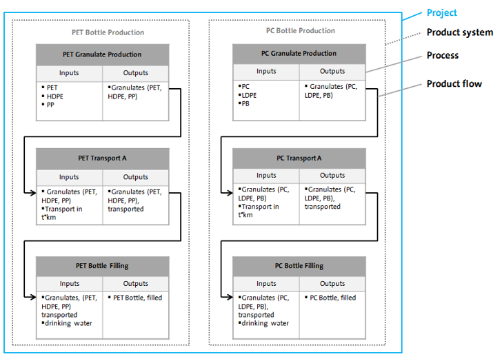

# Projects

In openLCA, projects are used to compare multiple product systems You can also use parameters to benchmark various options within the same product system. The resulting report is a powerful tool to communicate the results of your comparative study.

For instance, you can compare the production of polycarbonate (PC) and polyethylene terephthalate (PET) bottles using a project in openLCA (you can access this [bottle case study](https://nexus.openlca.org/casestudy/Other%20free%20case%20studies) for free). This comparison involves evaluating two or more product systems with a comparable functional unit:

  

Within a project, you can also vary parameters used in your product system. This allows you to compare different versions of the same product system, which is an essential part of conducting a "Sensitivity Analysis" in a comprehensive LCA study.
