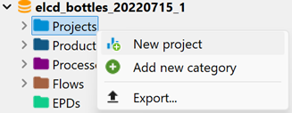
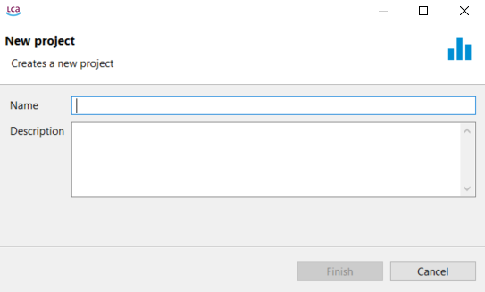
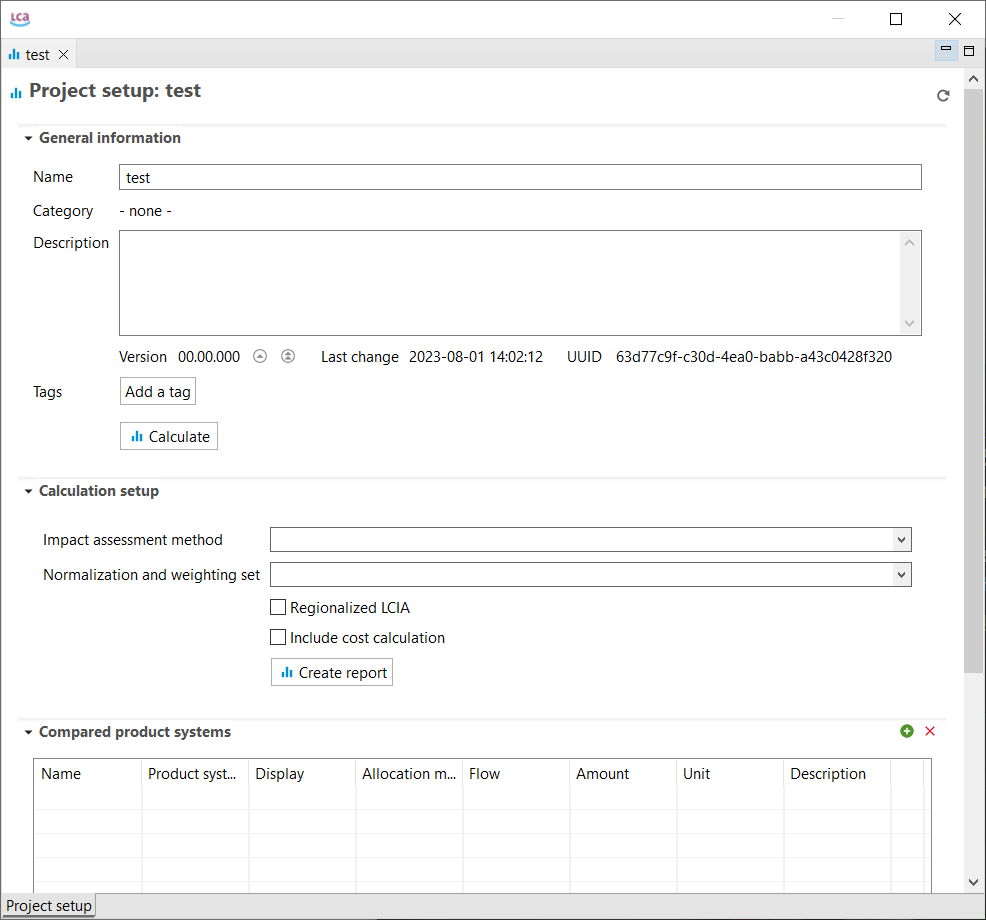
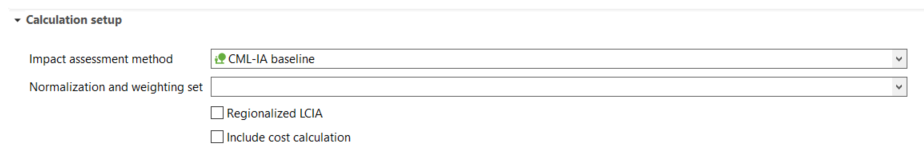
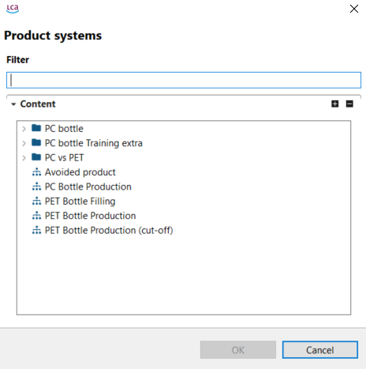
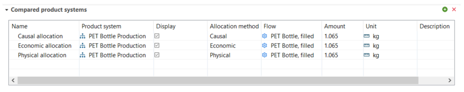
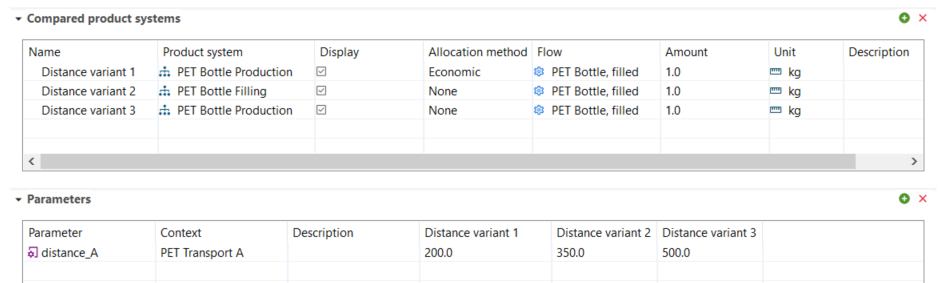

# Creating a new project

After you finished to model one or multiple product systems, you can create a "Project" to compare them. It should be noted that for a valid comparison, both processes should use the same functional unit. To create a new project, right-click on the "Projects" folder and select "New project".

  
_Step 1: Creating a new project_

Name the new project and provide a description (optional):

  
_Step 2: Creating a new project_

The new project will open in the Editor (check below for details):

  
_Project window_

<b>General information</b>

In the "General information" section you can edit the name of the project and optionally add a description. Moreover, you can add a [tag](../cheat/tags.md) and run the [calculation](../res_analysis/index.html).

>_**Note:**_ We recommend to create a report before running the calculation. Click on "Create report" in calculation setup section and then configure it in the new "Report" tab. Check [Report Template](report.md) section for details.

<b>Calculation setup</b>

In the "Calculation setup" section you can select the impact assessment method for the calculation, as well as normalization and weighting set, if applicable (you can select a set from the methods you've imported in the database, but only if the method you chose include one or you've created it yourself). You also have the option to select "Regionalized LCIA" and "Include cost calculation".

_Project setup, Calculation setup_

<b>Compare product systems</b>

In the "Compare product systems" section, click on the green "+" icon on the right to add the product systems you want to compare. In addition, drag-and-drop function is supported too.

 _Adding product systems to a project_

Each selected product system acts as a "variant" for the calculation. You can select the same product system multiple times and/or different product systems. For each variant, you can then provide a new name, a different allocation method and amount. For example, to compare three different allocation methods applied to the same product system, select that product system three times and then select a different allocation method for each. You can also decide which product systems to display in the results. 

_Project setup, Variants_

<b>Parameters</b>

In the "Parameters" section, it is possible to change parameter values for variants. For example, we can compare the impacts of a PET bottle production based on the transportation distance of the PET Granulates: 200, 350 and 500 km. In the "Compare product systems" section, you can select three times a product system for PET Bottle that contains a parameter for the transport distance (‘distance_A’).

Then rename each variant and in add the parameter ‘distance_A’ in the "Parameters" section by clicking on the green "+" button on the right and selecting it from those available. Eventually, enter a new parameter value for each variant.

_Project setup, Parameters_

Once you have configured your project in the "Project setup" click on "Create a report" to configure the report.

