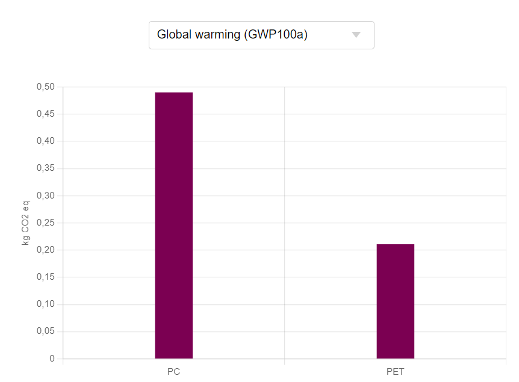
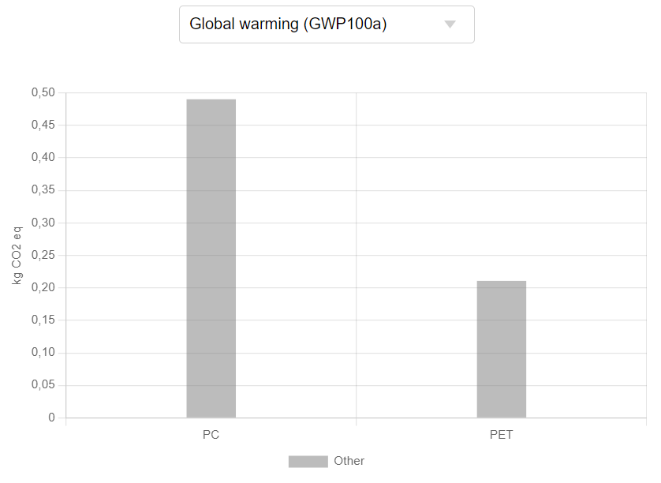
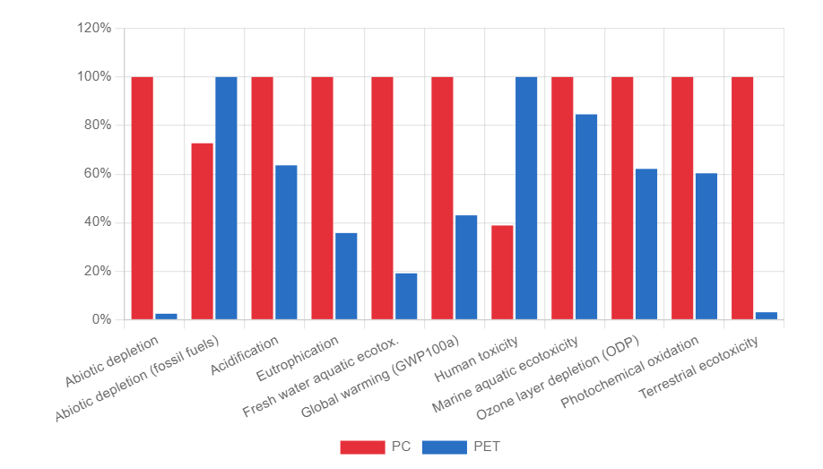
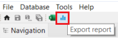

# Project report

In the report tab you will find the calculated results in the template you chose beforehand. It is generated as an html file with interactive elements based on Java. **The following is directly extracted from a report (_Java elements can not be displayed in this manual_):**

_**Note**_: If you report is not displayed correctly, make sure you have WebView2 (for Windows) or WebKit (for Linux) installed on your device.

<html lang="en"><head><meta http-equiv="Content-Type" content="text/html; charset=UTF-8">
</head>

<body>
    

<h2>Results of project: bottle filling comparison</h2>

<h3>Project Variants</h3>
This table shows the name and description of the variants as defined in the project setup. The variant names of the project setup are used for all charts and tables of the other report components.

<table><thead><tr><th>Variant</th><th>Description</th></tr></thead><tbody><tr><td>PC</td><td>Poly(carbonate) bottles</td></tr><tr><td>PET</td><td>Poly(ethylene terephthalate) bottles</td></tr></tbody></table>

<h3>Selected LCIA Categories</h3>
The table below shows the LCIA categories of the selected LCIA method of the project. Only the LCIA categories that are selected to be displayed are shown in the report. Additionally, a user friendly name and a description for the report can be provided.

<table><thead><tr><th>Indicator</th><th>Unit</th><th>Description</th></tr></thead><tbody><tr><td>Abiotic depletion</td><td>kg Sb eq</td><td></td></tr><tr><td>Abiotic depletion (fossil fuels)</td><td>MJ</td><td></td></tr><tr><td>Acidification</td><td>kg SO2 eq</td><td></td></tr><tr><td>Eutrophication</td><td>kg PO4--- eq</td><td></td></tr><tr><td>Fresh water aquatic ecotox.</td><td>kg 1,4-DB eq</td><td></td></tr><tr><td>Global warming (GWP100a)</td><td>kg CO2 eq</td><td></td></tr><tr><td>Human toxicity</td><td>kg 1,4-DB eq</td><td></td></tr><tr><td>Marine aquatic ecotoxicity</td><td>kg 1,4-DB eq</td><td></td></tr><tr><td>Ozone layer depletion (ODP)</td><td>kg CFC-11 eq</td><td></td></tr><tr><td>Photochemical oxidation</td><td>kg C2H4 eq</td><td></td></tr><tr><td>Terrestrial ecotoxicity</td><td>kg 1,4-DB eq</td><td></td></tr></tbody></table>

<h3>LCIA Results</h3>
This table shows the LCIA results of the project variants. Each selected LCIA category is displayed in the rows and the project variants in the columns. The unit is the unit of the LCIA category as defined in the LCIA method.

<table><thead><tr><th>Indicator</th><th>PC</th><th>PET</th><th>Unit</th></tr></thead><tbody><tr><td>Abiotic depletion</td><td>8.30177e-8</td><td>2.05033e-9</td><td>kg Sb eq</td></tr><tr><td>Abiotic depletion (fossil fuels)</td><td>1.50413e+0</td><td>2.06903e+0</td><td>MJ</td></tr><tr><td>Acidification</td><td>1.54539e-3</td><td>9.83064e-4</td><td>kg SO2 eq</td></tr><tr><td>Eutrophication</td><td>1.78441e-4</td><td>6.37300e-5</td><td>kg PO4--- eq</td></tr><tr><td>Fresh water aquatic ecotox.</td><td>1.42203e-3</td><td>2.71658e-4</td><td>kg 1,4-DB eq</td></tr><tr><td>Global warming (GWP100a)</td><td>4.90240e-1</td><td>2.10820e-1</td><td>kg CO2 eq</td></tr><tr><td>Human toxicity</td><td>6.15706e-3</td><td>1.58586e-2</td><td>kg 1,4-DB eq</td></tr><tr><td>Marine aquatic ecotoxicity</td><td>1.89337e+1</td><td>1.60211e+1</td><td>kg 1,4-DB eq</td></tr><tr><td>Ozone layer depletion (ODP)</td><td>1.43767e-11</td><td>8.93323e-12</td><td>kg CFC-11 eq</td></tr><tr><td>Photochemical oxidation</td><td>1.05529e-4</td><td>6.36538e-5</td><td>kg C2H4 eq</td></tr><tr><td>Terrestrial ecotoxicity</td><td>1.61762e-3</td><td>4.97121e-5</td><td>kg 1,4-DB eq</td></tr></tbody></table>

</body>

### Single Indicator Results

The following chart shows the single results of each project variant for the selected indicator. You can change the selection and the chart is dynamically updated (**not in the manual but in the software itself**).

_GWP single indicator PC vs. PET_

### Process Contributions

This chart shows the contributions of the selected processes in the project setup to the variant results of the selected LCIA category. As for the single indicator results, you can change the selection and the chart is dynamically updated.

_GWP process contributions PC vs. PET_

### Relative Results

The following chart shows the relative indicator results of the respective project variants. For each indicator, the maximum result is set to 100% and the results of the other variants are displayed in relation to this result. 

_All impact chosen impact categories for PC vs. PET_

### Exporting a project report

You can export a report in HTML format by clicking on the "Export report" icon located above the navigation panel. This option is available when the results window is open in the editor.

  
_Exporting a report in HTML format_

The program will prompt you to locate the folder where you want to export the HTML file. Once it is saved, you can open the HTML file with a browser (Internet Explorer, Mircosoft Edge, Safari Google Chrome, Mozilla Firefox etc.) to view the report.