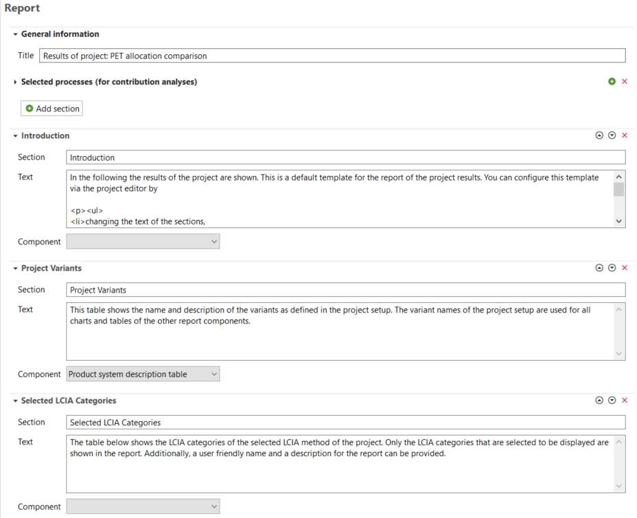
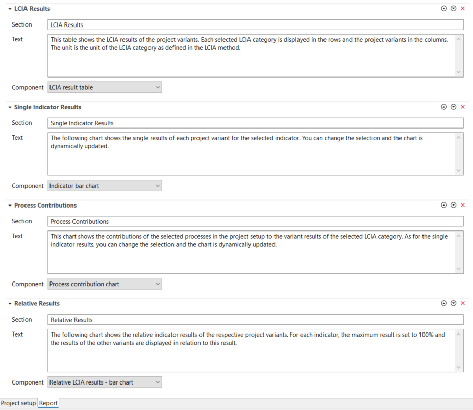
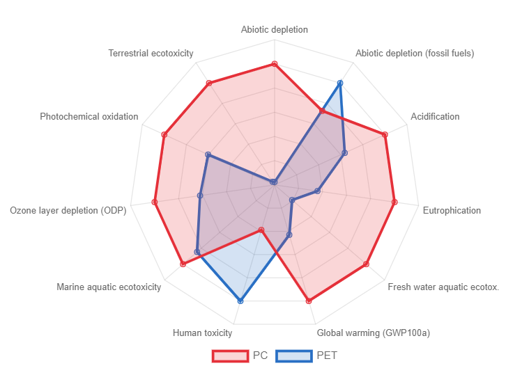

# Report Template

After clicking on "Create report" in the calculation setup section, you can configure it in the new "Report" tab. This report is generated along with calculations when you click the "Calculate" icon in the "Project setup" tab. By default, a report contains the sections "Introduction", "Project Variants", "Selected LCIA Categories", "LCIA Results", "Single Indicator Results", "Process contributions", and "Relative Results. In the "Report" tab, you can name the report, add or remove sections, rename sections, edit their descriptions, delete sections with the red "X" icon on the right, and change their order using the up/down icons. Additionally, you can select a "Component" for each section. For example, which type of chart or table should be displayed. After configuring all the sections, remember to save the project before generating the report. 

_Project, Report tab_

We want to emphasize our high variety of graphs for the communication of your results, e.g.:

-   Indicator bar chart

-   Relative LCIA results - bar chart

-   Normalization bar chart

-   Relative LCIA results - radar chart

-   Normalization radar chart

-   Single score bar chart

-   Process contribution chart

_Relative LCIA results - Radar chart example (In the software the mouse over allows to access more details)_

**_Note:_** For normalized charts, the normalization method needs to be selected in the "Calculation setup" section of "[Creating a new projet](./new_proj.md)".

