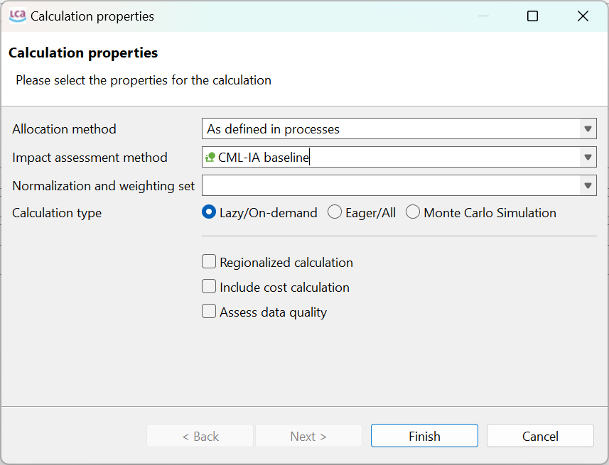

# Calculation and Result Analysis

After you've completed the modeling of your processes, created your life cycle model (product system), or finished constructing your project report, it’s time to move on to the calculation. 

  
_Calculation properties_

To start the calculation for a product system, have the product system open, and then press on the "Calculate" green botton. In the upcoming screen, you can customize the calculations according to your requirements. You can choose the allocation method, the impact assessment method, normalization and weighting set, the calculation type (lazy, eager or Monte Carlo simulation) or whether to include regionalized calculations, cost calculations or data quality. In detail:

- **Allocation method:** Here you can choose the allocation method applied in the calculation. Options are none, casual, physical, economic, or "as defined in process". "None" is the default setting. "As defined in process" means here that the allocation is performed as defined prior in **each** process (you could have different allocation methods in different processes). See the section [Allocation](../allocation.md) section for more details. 

- **Impact assessment method:** Here you can choose the [Impact assessment method](../lcia_methods/impact_methods_tab_contents.md) from the list of methods available in your activated database. If no methods are listed, you need to first import a method pack into the database, or create a new method.

 - **Normalization and weighting:** In this section, you can select a normalization or weighting set for your values. This set needs to be present in the impact assessment method. If the chosen method doesn't have any set, you  need to add them to the impact assessment method first.

- **Eager/all & Lazy/On-demand:** You can choose to perform the calculations in "Eager/All" or "Lazy/On-demand" mode. Eager calculation provides complete results upfront, while lazy calculation offers faster navigation and on-demand calculation of impacts. For more details see section [Lazy vs Eager calculation](../res_analysis/lazy_eager.md).

- **Monte Carlo Simulation:** You can perform uncertainty calculations using Monte Carlo simulation. This method considers all uncertainty distributions defined in flows, parameters, and characterization factors, with the exception of the one associated with the reference product of the system. Check [Monte Carlo simulation](../advanced_top/monte_carlo.md) section for details.

- **Regionalized:** Check this box if you want to calculate the results in dependence of regions using geoJSON files. Check [Regionalized Calculation](../advanced_top/regionalized.md) section below for details.

- **Include cost calculation:** This option additionally performs cost calculation. Check [Life Cycle Cost Calculation](../advanced_top/LCC.md) section for details.

- **Access data quality:** If you've included data quality information in your processes, this option will calculate the data quality for your results. Be sure to define the details of the data quality assessment by clicking "next" before proceeding with the calculation. Especially, the data quality system specified here must be referenced by the processes. Check [Data Quality](../advanced_top/data_quality.md) section for details. 

