# Result Analysis

Once the calculation is done, the window with the results will appear in the editor. Check below for details.

<b>General information</b>

The General Information tab provides details about the product system for which the impact was calculated. It includes information on the allocation method, target amount, the LCIA method used, and data quality information.

In the "Top 5 contributions to impact category results - overview" section, you can see the five processes with the highest direct contributions to the selected impact assessment category. Likewise, in the "Top 5 contributions to flow results - overview" section, you’ll find a bar chart illustrating the five processes with the highest direct contributions to the selected flow. You can change the flow for which the information is displayed by selecting a flow from the list. You can  save the diagram as image by clicking on the picture icon far right on the bar above the histogram.

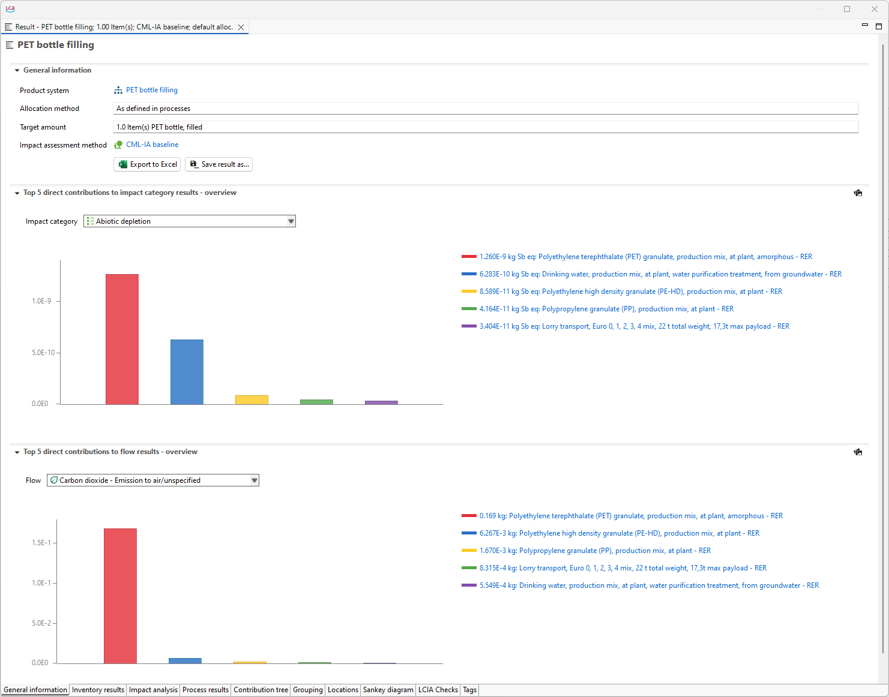    
_General information tab_

On the "General Information" tab you will also find the option to export and save your results. For more information see section "[Save and Export Results](./save_export.md)".

<b>Inventory results</b>

In the first two tables in "Inventory results" you find the list of all the input and output flows of the product system, showing the amounts and units for each on them. You can sort the flows alphabetically, by category, unit or amount, clicking on the corresponding header cell. Additionally, If you click on the arrow symbol before the flow’s name in the Inputs or Outputs section, you will see all processes in the product system that use that specific flow, and thus contribute to its amount in the result.

  
_Inventory results tab_

You can copy the content of all tables in openLCA editor and paste it into other applications like Excel or Notepad. Simply select the desired information with " Crtl + Click" (multiple selection) or " Crtl + A" (overall selection) and copy it with " Crtl + C" or by right-clicking and then clicking "Copy".

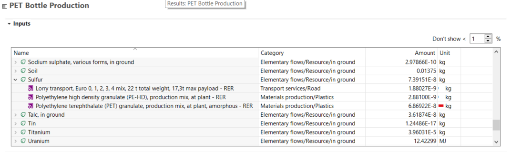  
_Inventory results, inputs section_

The last table on this tab is called "Total requirements". The first columns contain all the processes that are included in the product system. The second column shows the output product of the corresponding process, followed by its he amount and unit.

If you check the box "Include Cost Calculation" when setting the calculation properties, the total requirements table will also show the added value for each process. Check  "[Life Cycle Costing](../advanced_top/LCC.md)" section for details. Likewise, if you check the box "Assess data quality" when setting the calculation properties, this table will also show information about data quality in the Inputs and Outputs sections according to the data quality schema previously defined for "[Processes](../processes/index.html)". For more information about "[Data Quality](../advanced_top/data_quality.md)" check the dedicated section. 

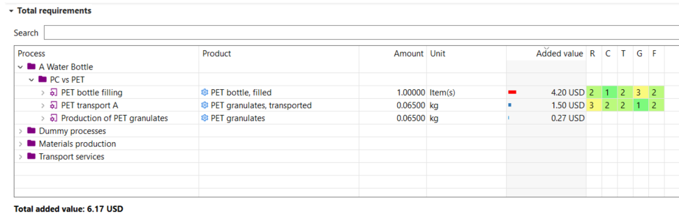  
_Inventory analysis - added value calculation & data quality information_

<b>Impact analysis</b>

This tab is visible in the results window only when you've chosen an impact assessment method in the calculation wizard. In the table, you can view the results with its reference units ("Impact assessment result" column) for each impact category. You can also select whether to display associated processes or flows (choose which one you want to see in the "Sub-group by:" section above the table) contributing to these impact categories by clicking the arrow next to the impact category name to expand them.

If you checked the box "Assess data Quality" when setting the calculation properties, information about data quality is displayed in the Impact analysis according to the data quality schema previously defined for the processes, see section "[Processes](../processes/index.html)". 

  
_Impact Analysis, data quality_

<b>Process results</b>

The "Process results" tab shows both the direct and the total upstream contributions to the impact, per process. Direct contributions/impacts are those resulting solely from a specific process.

In the section "Flow contribution to process results", select a process from the drop-down list and the input and output flows that contribute to that flow will be listed. In impact assessment results, results are shown for all impact categories of the selected LCIA method.

  
   
_Process results tab_

If you want to export your results including the upstream contribution please copy them from this tab (directly to an Excel sheet e.g.).  

<b>Contribution tree</b>

The contribution tree breaks down process contributions to flows and impact categories, displaying upstream totals. This feature allows you to check for every flow in which process is involved, and similarly, for every impact category which are the processes responsible of the impact, and in what percentage. You can access further details expanding the processes by clicking on the little arrow before the percentage. This way, you can see which processes are the largest contributors to a given impact category and which processes are the largest contributors to a given flow emission. Meaning that the contribution tree can be used to easily look for impact hot-spots withing the life cycle (processes with the highest contribution).
 Note that it can be possible that the percentage of the single processes do not add up to 100%, because the contribution in percentages always display the contribution of the total upstream (supply chain) without the direct contribution of the corresponding process. But you can easily check the absolute amounts of direct contributions inside a process with the last column "Direction contribution" in the contribution tree.  

_Analysis - Contribution tree tab_

If you check the box "Include Cost Calculation" when setting the calculation properties, the contribution tree breaks down process contributions to cost categories (added value or net cost), displaying upstream totals. The economic perspective can be changed by selecting added value or net cost.

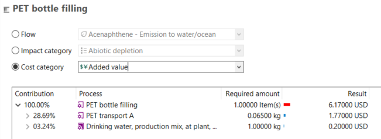 
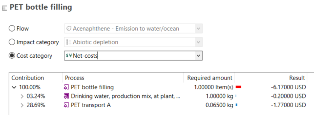 
_Analysis - Contribution tree tab, cost category_

<b>Grouping</b>

In openLCA, it is possible to group products to see the cumulative values of these grouped products. This is very helpful if you want to group your impacts according to categories like **"Transport", "Electricity", "Production" or even by life cycle stage**. The values shown in the "Grouping" tab are the direct impacts (i.e. upstream values are not included).

To create a new group, select the green "+" icon in the right-hand corner of the editor. Then name the new group.

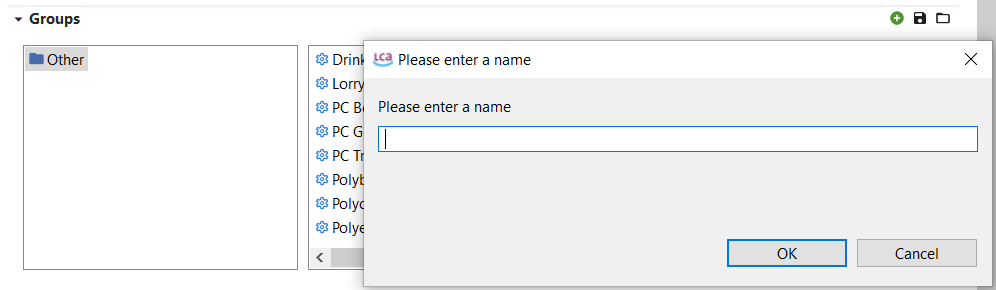  
_Step 1: Creating a new group_

To display the list of all product and waste flows within your product system not yet assigned to a group click on "Other". If you want to move a product flow to a group, right-click on the flow, select "move," and choose your desired group. To select multiple processes together, click one process, then hold "Shift" and click another product. If you want to avoid selecting all products in between, use "Ctrl" instead of "Shift".

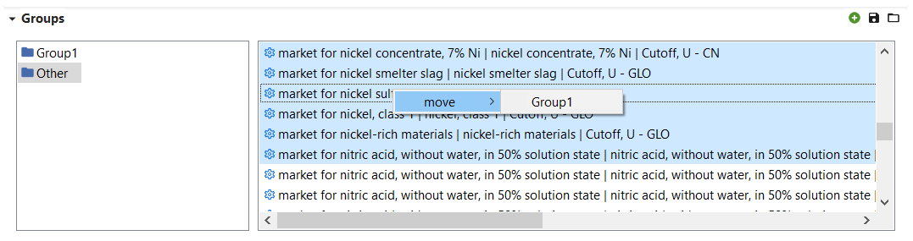  
_Step 2: Creating a new group_

Once you have created groups and added product / waste flows to them, their contributions for specific flows and impact categories will be displayed in the table and as a histogram chart. Please note, the contributions displayed are direct (i.e. without upstream contributions). To consider upstream contributions, you must include all upstream processes in the group.

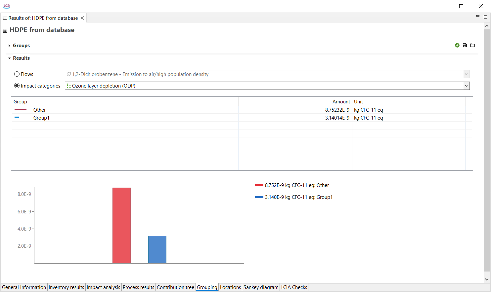  
_Grouping, results_

Once the grouping is done, openLCA allowes to save the grouping for also other result analysis. You can save groups in the Grouping tab by clicking on the "Save" icon located in the top right-hand corner of the Grouping editor. Give the group a name and press "OK". These groups will be available in the results editor each time you carry out a direct or classical calculation for any product system.

To open saved groups, click on the folder icon in the top right-hand corner of the Grouping tab.

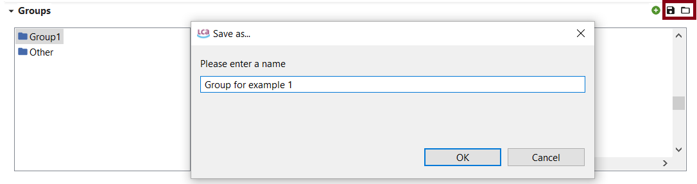  
_Saving and opening saved groups_

**This option is extremly helpful if you want to harmonize the way various calculation results are analyzed!**

<b>Locations</b>

  
_Locations tab_

The location tab illustrates specific information on localized flows and impact and cost categories (if you checked box "Include Cost Calculation" when setting the calculation properties). The locations are set in the flow level in openLCA.

The location contributions are only displayed if the database contains the geometries of the locations (e.g. by importing the ecoinvent geometries).

You can adjust the map's position by clicking on it and moving the mouse. To zoom in or out, use the scroll wheel on your mouse.

<b>Sankey diagram</b>

The Sankey diagram visually represents the impacts of processes within the product system on specific flows/impact categories. The diagram shows both the direct contribution and the upstream total contribution of the process. To open a process in a new editor tab, simply double-click on it.

Right-click anywhere in the Sankey diagram editor and select:

-   "Focus" to focus on the process the calculation is based

-   "Minimap" to displays/hides the minimap

-   "Layout as tree" to update the order of the processes

-   "Settings of the Sankey diagram" to select the flow or impact and cut-off level to be displayed.
	
-   "Save as Image" to save the Sankey diagram as png file.

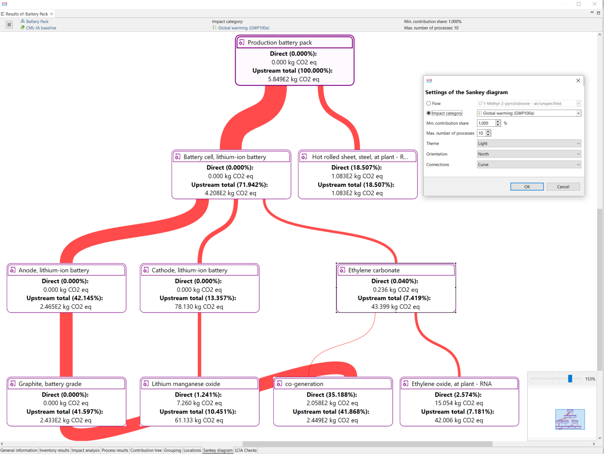  
_Sankey diagram_

You can access the "Setting of the Sankey diagram" wizard by clicking on the "Filter" icon located in the top left corner. Here you can specify:

-   If you want to display a flow or an impact category

-   Cost category (only accessible if you included cost calculations in calculation setup)

-   Min. contribution share (inferior contribution limit for a process to be shown in the diagram)
	
-   Max. number of processes that can be shown in the diagram

-   Design settings: theme, orientation, shape of the connections

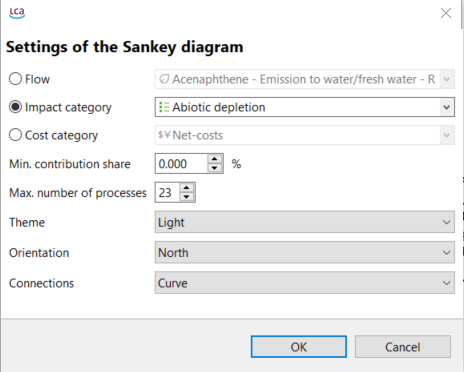  
_Sankey Setting wizard_

Next to the "Filter" icon you can open the product system and the impact assessment method. See the current set "Min. contribution share" and "Max. number of processes".

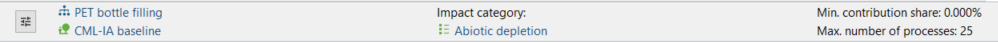  
_Sankey diagram options_

<b>LCIA checks</b>

The LCIA Checks tab provides a list of all flows in the Life Cycle Inventory (LCI) that were not considered by the applied LCIA method. The flows can either be listed regardless of the LCIA category or grouped by LCIA category.

  
_LCIA Checks tab_

