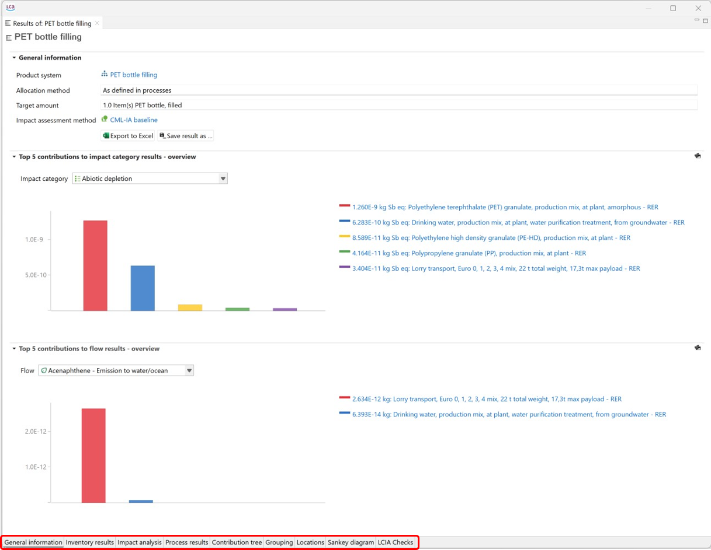

# Result Analysis

Once the calculation is done, the window with the results will appear in the editor. 

In the following chapters we'll explore every tab in details.

- [General information](../res_analysis/res_general_info.md)
- [Inventory result](../res_analysis/res_inventory_result.md)
- [Impact analysis](../res_analysis/res_impact_analysis.md)
- [Process results](../res_analysis/res_process_results.md)
- [Contribution tree](../res_analysis/res_contribution_tree.md)
- [Grouping](../res_analysis/res_grouping.md)
- [Locations](../res_analysis/res_locations.md)
- [Sankey diagram](../res_analysis/res_sankey.md)
- [LCIA checks](../res_analysis/res_lcia_checks.md)

