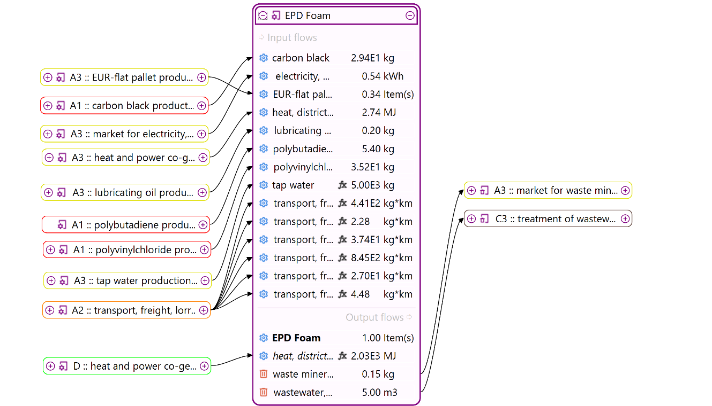

# _New!_ Analysis groups

Since openLCA v2.4, you can conveniently categorize your product system's processes into various categories allowing later to group results. This is particularly helpful if you assign groups according to the EN15804+A2 modules as used for EPDs. Moreover, it allows us to analyze life cycle stages without changing the connectivity within the model graph. 

After creating the product system, you can hover over a process in the model graph, right-click, and choose the desired option as seen below:

A pop-up window will appear, allowing you to set up a new analysis group by clicking "add analysis group" or selecting "Add EN 15804" from the drop-down menu for predefined group analysis according to the EN15804+A2 lifecycle modules.

If you select "add EN 15804 modules", a pop-up window will appear allowing you to assign the selected process under any category. You can delete any group by clicking the "x" sign next to it. 

You can also create a new one, by clicking on “Add analysis group” at the end of the list:

It is also possible to set colors, by clicking on the color box in front of any group, to categorize the processes in the model graph, as shown below:

The chosen colors are then visible in the model graph respective to the group.

After saving the work, you can perform the calculation and view the group analysis results in the “analysis groups” tab below the results window. You can also investigate results contribution per flow and impact categories as seen in the lower side of the window. Further, you can click on any impact category and copy-paste the entire table of impact assessment results into Excel. 

If you selected the EN15804 module group initially or followed such a structure, it's also possible to directly create an EPD by clicking on the EPD icon at the top right of the window. A pop-up window will appear, where you can click "OK".

The EPD and the results per group shall appear in their respective locations, as in the picture below, and they can also be exported as JSON-LD.

## Focus: Are group analysis results same as the contribution tree? 

In openLCA, when you're analyzing the environmental impact of a product or process, you can view the results in two different ways: **contribution trees** and **analysis groups**. These help you understand which parts of the supply chain are responsible for which portions of the total impact.

Now, the results from these two views only match exactly when there are no overlapping groups along a supply chain path. If one group contains another (like a group within a group), it can count the same impact more than once, which causes differences in the totals.

**Simple example:**

Imagine a product system with 5 steps, from E (raw material) to A (final product). Each step contributes an equal impact of 1. So the total impact is 5.
We also assign some of these steps to analysis groups:

- B is in group **g1**
- D is in group **g2**

In the contribution tree, the numbers just add up along the path:

But for **analysis groups**, we have to be careful not to double-count:

- **g2** (D and everything below) = **2**
- **g1** (B and its upstream) = 4, but since D is already counted in g2, we subtract that: 4 – 2 = **2**
- The **top level** (A) = total – g1 = 5 – 2 = **1**

Still totals to 5, but **we avoided double-counting** by subtracting the already-included impacts.

