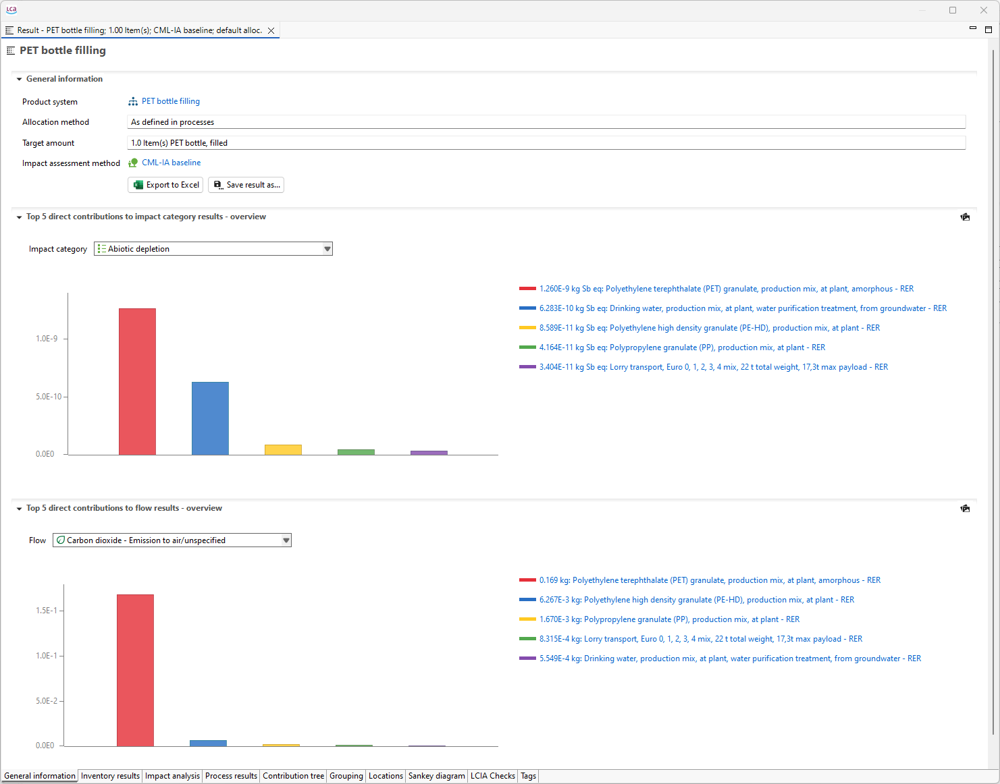

# General information

The General Information tab provides details about the product system for which the impact was calculated. It includes information on the allocation method, target amount, the LCIA method used, and data quality information.

In the "Top 5 contributions to impact category results - overview" section, you can see the five processes with the highest direct contributions to the selected impact assessment category. Likewise, in the "Top 5 contributions to flow results - overview" section, you’ll find a bar chart illustrating the five processes with the highest direct contributions to the selected flow. You can change the flow for which the information is displayed by selecting a flow from the list. You can  save the diagram as image by clicking on the picture icon far right on the bar above the histogram.

    
_General information tab_

On the "General Information" tab you will also find the option to export and save your results. For more information see section "[Save and Export Results](./save_export.md)".

