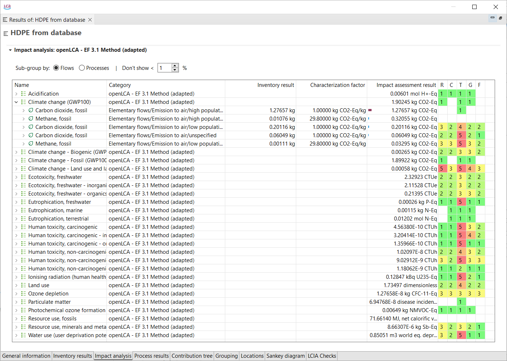

# Impact analysis

This tab is visible in the results window only when you've chosen an impact assessment method in the calculation wizard. In the table, you can view the results with its reference units ("Impact assessment result" column) for each impact category. You can also select whether to display associated processes or flows (choose which one you want to see in the "Sub-group by:" section above the table) contributing to these impact categories by clicking the arrow next to the impact category name to expand them.

If you checked the box "Assess data Quality" when setting the calculation properties, information about data quality is displayed in the Impact analysis according to the data quality schema previously defined for the processes, see section "[Processes](../processes/index.html)". 

  
_Impact Analysis, data quality_

</di>