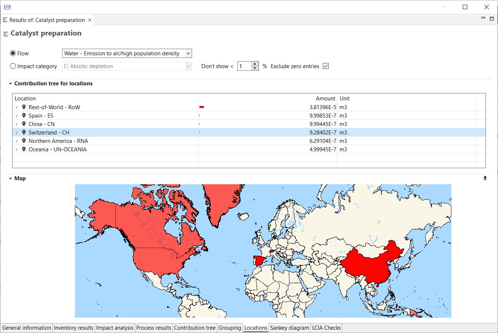

# Locations

  
_Locations tab_

The location tab illustrates specific information on localized flows and impact and cost categories (if you checked box "Include Cost Calculation" when setting the calculation properties). The locations are set in the flow level in openLCA.

The location contributions are only displayed if the database contains the geometries of the locations (e.g. by importing the ecoinvent geometries).

You can adjust the map's position by clicking on it and moving the mouse. To zoom in or out, use the scroll wheel on your mouse.