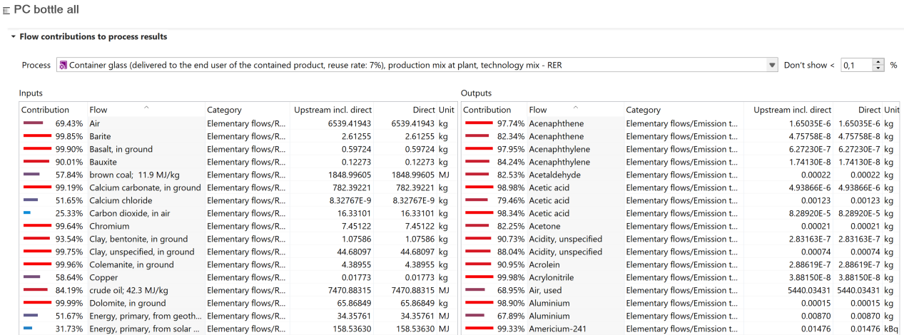
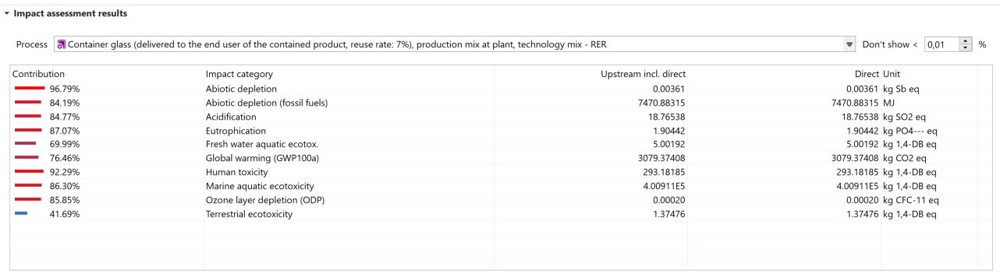

# Process results

The "Process results" tab shows both the direct and the total upstream contributions to the impact, per process. Direct contributions/impacts are those resulting solely from a specific process.

In the section "Flow contribution to process results", select a process from the drop-down list and the input and output flows that contribute to that flow will be listed. In impact assessment results, results are shown for all impact categories of the selected LCIA method.

  
   
_Process results tab_

If you want to export your results including the upstream contribution please copy them from this tab (directly to an Excel sheet e.g.).  

