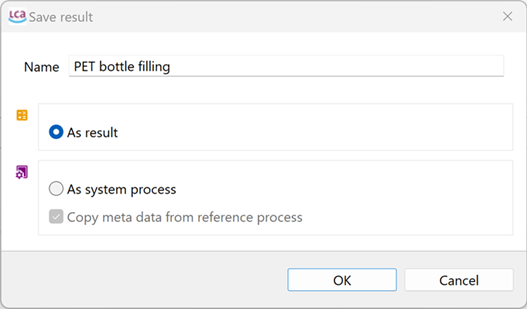
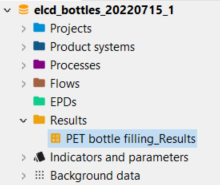
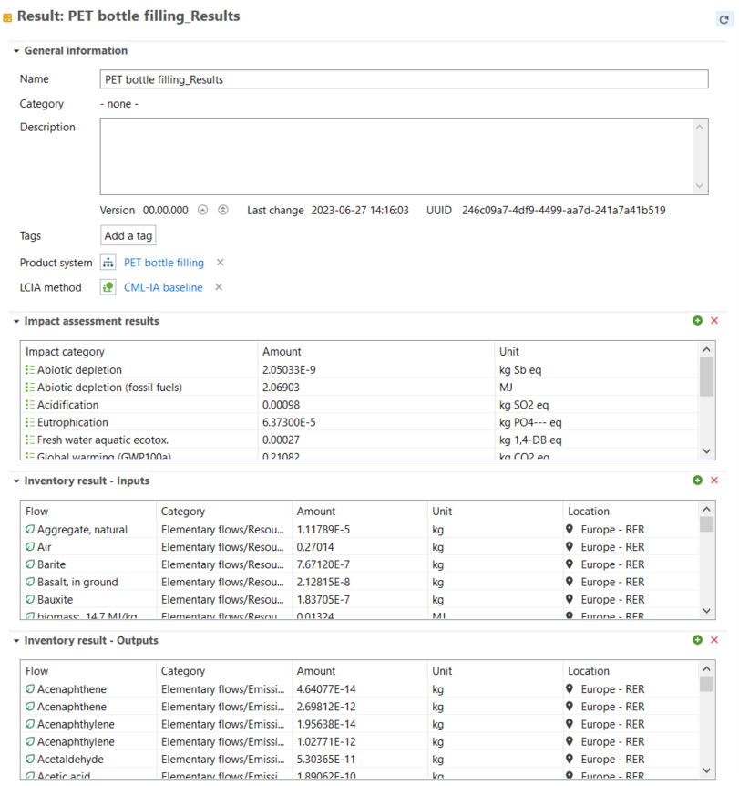
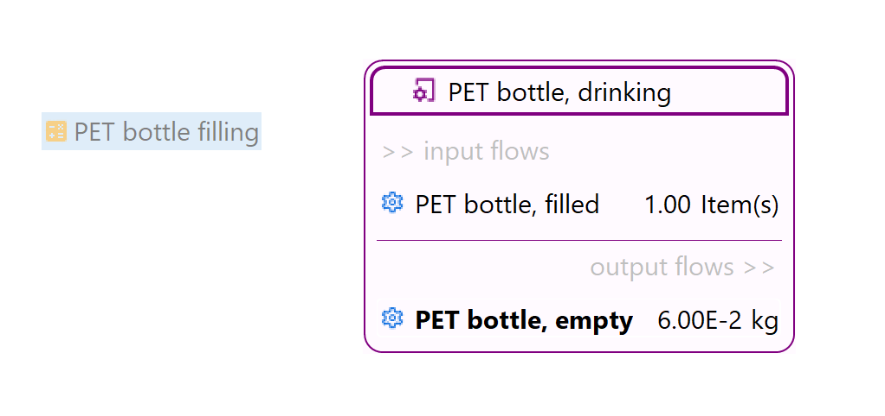
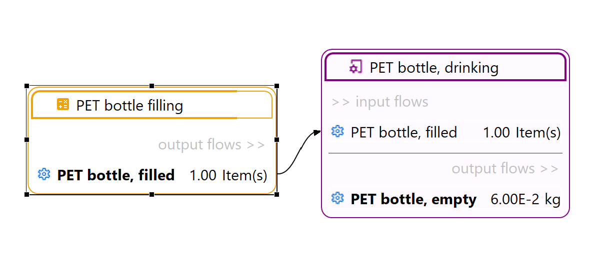
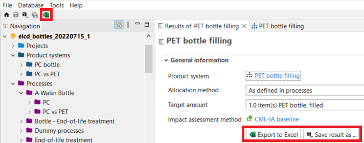
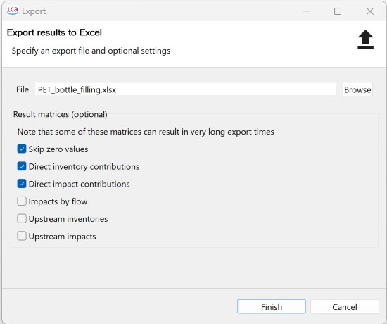

## _New!_ Save results

By clicking the "Save results as..." button in the General information tab of a product system results window. Alternatively, you can select "File" → "Save" above the navigation panel, you can save your results as either a "result" or as a system process.

  
_In openLCA 2 you can save results or even create a system process based on the results_

**Save as result:** 

- This option creates the folder "Results" in the navigation panel.
- The tab "Results" displays general information, Impact assessment results and Inventory results (Inputs & Outputs).
- Saving your results as a "result" allows you to easily access your results without the need to re-calculate them. In addition, it can serve as an easy way to compare calculations e.g. change of LCIA method. They can also be direclty used in product systems (see next paragraph).
 
  
  
_Saving results as a result_

**Save as system process:**

- This option creates a system process which is helpful if you want to use your results in another product system. This option also supports to hide detailed information on your product system. 

## Drag and drop of results in the model graph

With openLCA 2 you are now able to add saved results by drag and drop the results into the model graph: 

  
_Drag-and-drop of a result into the input flows of a process_

Then, the reference flow of the result can be directly linked into other processes in the model graph.

  
_In the model graph, the reference flow can be linked to the same flow of another process_

This option is particularly helpful when working with EPDs. Check ["Using results of EPDs in the supply chain"](../epds/life_cycle_models.md) section for more details.

## Export Results

The "Export to Excel" option in the "General information" tab or the "Excel" icon above the navigation panel enables you to export your results as an .xlsx file.

  
_Saving and exporting results_

You can then choose the export configuration that best suits your needs:

_**Note:**_ At the current state the results can not be exported as ILCD data but openLCA allows to export the results as JSON-LD data.

