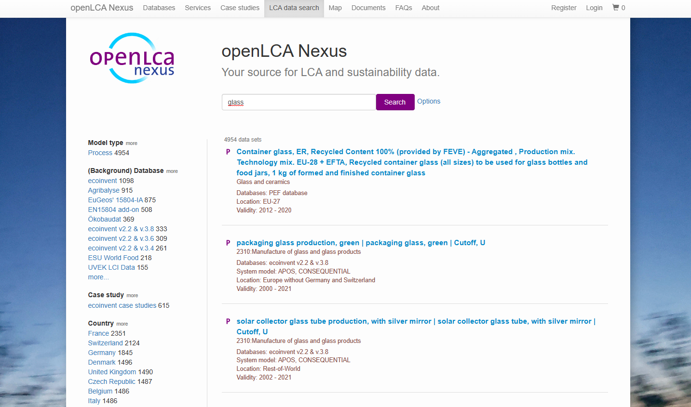
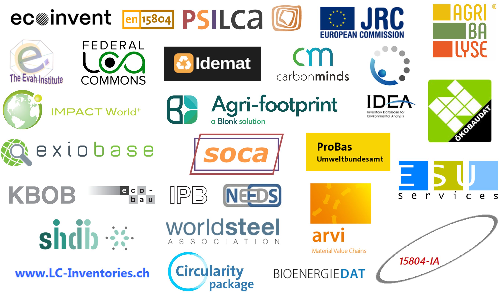
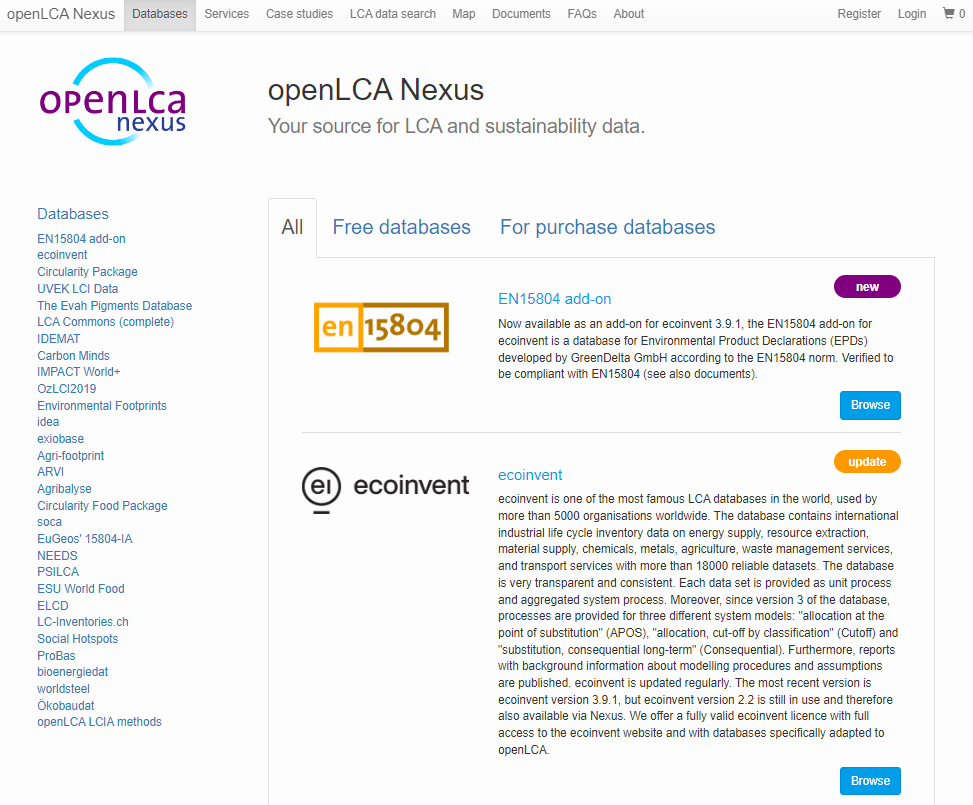
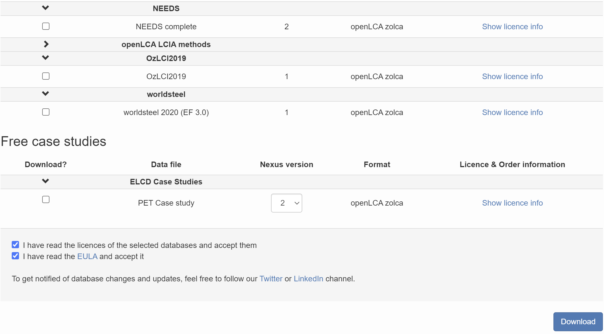

# openLCA Nexus

 
openLCA is a free and open source software. However, many LCA databases are not for free. GreenDelta has created [openLCA Nexus](<https://nexus.openlca.org/>), an online repository for making LCA data available to users. It contains free and "for purchase" data. Some are shown in the image below. 

Moreover, the Nexus website allows you to search for data sets in Nexus. It is also possible to filter data sets by the data provider, location, category, price and year of validity. 

_openLCA Nexus homepage search function_

## Databases

openLCA offers the largest collection of data sets and databases worldwide for LCA software, some for purchase, some for free. Altogether, around 300,000 different data sets are available on [Nexus](../introduction/nexus.md).

  

_Extract of available databases at openLCA's platform Nexus_

Most databases support the same reference flows and impact assessment methods. Some databases are separate, and do not mix with the others. An example are Input/Output databases such as PSILCA, the SHDB, or exiobase.

## Accessing databases from openLCA Nexus

On Nexus, you can use the search engine and the "Map" feature to explore the content of the available databases.

  
_openLCA Nexus website_

To order and download a database from the openLCA Nexus site, please follow these steps:

1. **Register an account at Nexus and log in:** We are committed to stringent data protection principles to ensures the security of your privacy.

2. **Select the desired license and add it to the cart:** Navigate the "Databases" section, explore the available licenses, and select the one that aligns with your requirements or preferences. Note that some databases may be available for free, while others require payment.

3. **Place an order:** Once you have added the license to your cart, proceed to place an order. You can check openLCA Nexus website's [FAQs](https://nexus.openlca.org/faqs) for more information about database licenses.

4. **Approval and database download:** After your order is approved, go to the "Downloads" section on the Nexus website. This section is located in the upper right-hand corner of the page when you are logged in. Here, you will find a list of data files available for download.

5. **Select files and format:** Select the files you wish to download from the available options and choose the format you prefer (if applicable).

6. **Review and accept licenses:** Before downloading the file, carefully read and agree to the licenses and the End User License Agreement (EULA) by checking the two box at the bottom

7. **Download:** Click on the "Download" button to start the download process.

    
    _Downloading a database from openLCA_

**_Note for macOS users:_** If you are using Safari, the browser will automatically unzip your downloaded zip files. However, you need the zipped file for import in openLCA (e.g. when you want to import JSON-LD, methods packages, ILCD...). You can solve this issue in two ways: 

1. Use another browser for downloads, where the zip-files are not automatically unpacked after successful download.

2. Zip the archives again by using a third-party tool, because the build-in archive tool from Apple will add additional resources to the zip-file that can create issues when importing the file in openLCA.

