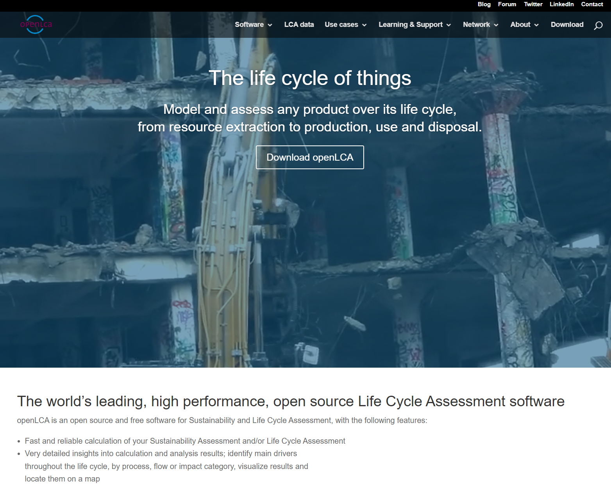

# openLCA.org

Our [website](<https://www.openlca.org/>) offers a range of services for both new and existing openLCA users. you can find download links for the software, source code, openLCA LCIA Method Pack, case studies, user manuals, and links to instructional videos. Go and check out our [Learning & Support](<https://www.openlca.org/learning/>) section.

  
_Our openLCA homepage_

