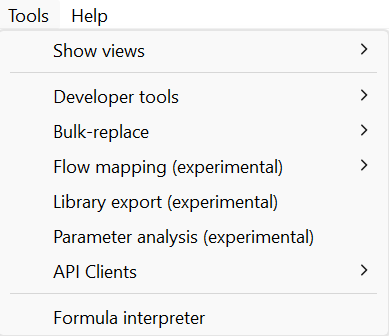

# Toolbar: Tools

The following options are available under "**Tools**":

  
_Options under Tools_

- **Show views**

    The following options are available after clicking on "**Show views**" and "**Other...**":

      
    _Options under **Show views, Other...**_

    - **_General_**

        - _Console:_ Displays the log file
        - _Minimap:_ Not available, a relict from creating openLCA with eclipse
        - _Outline:_ Displays a list of all the processes of a product system, including all its background processes. It is only applicable after you’ve created a product system. Open the product system’s Model Graph (tab) and choose the "Outline" option from "Views". The outline allows you to choose the processes you wish to show or hide from the Model Graph.
        - _Palette:_ Not available, a relict from creating openLCA with eclipse (don't worry)
        - _Properties:_ Not available, a relict from creating openLCA with eclipse (don't worry)

    - **_Other_**

        - _Commit History:_ Shows the commit history of the synchronization with the
    collaboration server, see section "[Link with Collaboration Server](../collaboserver.md)".
        - _Compare with repository:_ Shows the comparison with the
    collaboration server, see section "[Link with Collaboration Server](../collaboserver.md)".
        - _Navigation:_ The Navigation window displays the databases you have imported
    into openLCA and all the data sets they include.

- **Developer Tools:** 

    -   _SQL_: A tool that can be used to carry out SQL queries in openLCA.
    -   _Console_: The console tool is the live feed of our program with the same content as our log-file.
    -   _Python_: openLCA supports the possibility to run Python programs directly in openLCA. With this feature, you can automate calculations in openLCA, write your own data imports or exports, perform sensitivity analysis calculations by varying parameter values, and much more.
    -   _IPC Server_: Inter-Process Communication is a platform-independent data exchange interface via _HTTP_. _IPC_ Server allows running openLCA services via Python’s standard library

    However, to run the scripts use the respective button (green arrow) in the tool bar.

- **Bulk-replace:** It is a tool that allows the replacement of a flow or product
    provider with another flow or provider. To find out more details on bulk-replace see "[Using mapping files in openLCA](../databases/mapping_validation.md)" chapter.
    
- **Flow mapping (experimental):** Still under development but already available for you!

- **Library export (experimental):** Still under development but already available for you!

- **Parameter analysis (experimental):** Still under development but already available for you!

- **soda4LCA:** See [soda4LCA](../epds/soda4lca.md) chapter.

- **CS Servers:** See [the collaboration server manual](<https://manuals.openlca.org/lca-collaboration-server/>).

- **Get EPDs from EC3:** With openLCA 2 it is now possible to download or download EPDs from EC3 (Embodied Carbon in Construction Calculator) by [Building Transparency](<https://www.buildingtransparency.org/>). This requires access to the Building Transparancy server. Also an upload is possible.

- **Formula interpreter:** Use this interpreter to check if your formulas are correct. More information on the interpreter is accessible by opening the formula interpreter and typing "help" in the command line.

      
    _openLCA Formula Interpreter_

