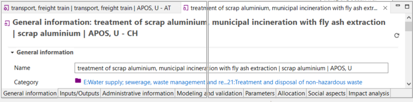

# Working with tabs

In openLCA 2, every new window is organized as a tab next to the welcome one within the main window. Right-clicking on a tab provides different management options, improving the user-friendliness of openLCA.

  
_Right-clicking a tab_

Tabs can be detached and moved around on the screen. By dragging and dropping a detached tab next to an existing tab in openLCA, you can reverse the detachment. This feature allows you to run openLCA in a single-window and multi-window mode, particularly beneficial when working with multiple screens.

To show two tabs either underneath or next to each other, drag one tab till a double line appears on your screen.  

_Placing tabs underneath or next to each other_  

>**_Note:_** An asterisk "*" in front of the tab's name indicates that the data of your tab is
not saved and therefore an older state of this tab will be included in any calculation. 

>_**Note**_: If you are unhappy with your choice of tabs and windows, you can always reset them under File → Preferences → Configuration → Reset Window. 

