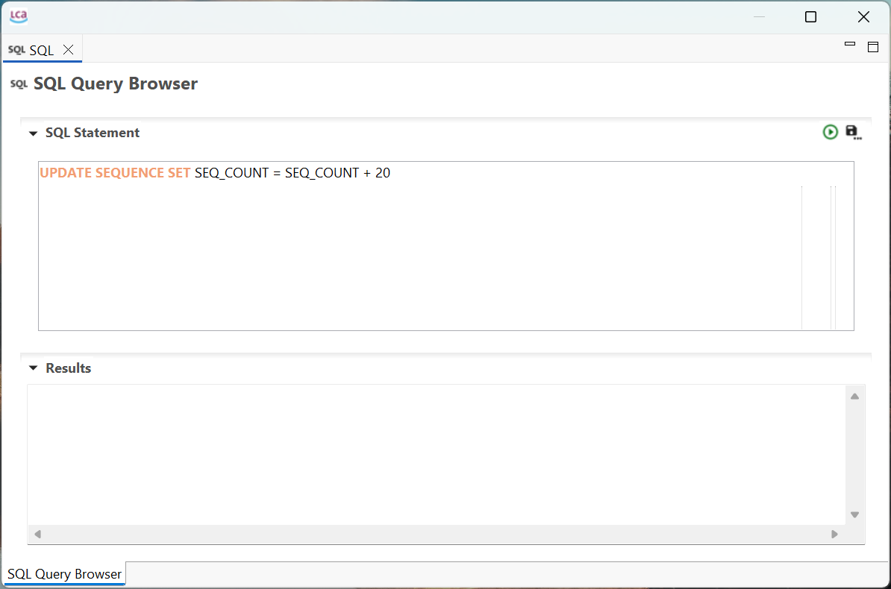

# Scripting in openLCA

openLCA provides powerful scripting capabilities to automate tasks, analyze models, and integrate
life cycle data into external tools or workflows. There are two main approaches for scripting:

- Jython (Python) scripting within the openLCA application itself

- Inter-process communication (IPC) using the openLCA IPC API

Both approaches enable automation and interaction with openLCA models, but they differ significantly
in how and where scripts are executed, their use cases, and their limitations.

## Jython

[Jython](https://www.jython.org/) is a Python interpreter for the Java platform, and its interpreter
is embedded within the openLCA application. Python scripts are compiled to Java bytecode and
executed in the same Java runtime environment in which openLCA runs. This allows the scripts to
directly access and interact with openLCA’s internal resources—such as the user interface, the
current database connection, and other Java components.

It’s ideal for small tasks, data extraction, custom calculations, or batch modifications within the
openLCA GUI. Since Jython runs inside openLCA, you have access to internal variables like the
current database connection and the graphical interface.

📘 We provide a dedicated manual for Jython scripting in openLCA, including real-world examples:
[Jython scripting manual](https://greendelta.github.io/openLCAJython-manual/).

You can also check out some examples on our
[GitHub](https://github.com/GreenDelta/openlca-python-examples/tree/main/Jython).

## Inter-process communication (IPC)

The openLCA IPC (Inter-process communication) protocol allows you to control openLCA from an
external script or application. This is especially useful for integrating LCA calculations into
automated workflows, external tools, or larger systems. The IPC protocol is language-agnostic and
can be used by any application written in any programming language (e.g. Python,
JavaScript/TypeScript, .Net, Go, etc.).

This protocol is provided by an openLCA IPC server, which can either be a running instance of the
desktop application or a web server with an openLCA back-end. An application can connect to such an
IPC server to call functions in openLCA, perform calculations, or interact with the database
remotely.

📘 To get started, check out the official API documentation:
[openLCA IPC API](https://greendelta.github.io/openLCA-ApiDoc/).

You can also check out some examples on our
[GitHub](https://github.com/GreenDelta/openlca-python-examples/tree/main/Python%20IPC).

## When to use Jython vs. IPC

Both Jython scripting and IPC scripting offer powerful ways to interact with openLCA—but which one
is right for your use case? The decision depends on factors like whether you prefer scripting inside
openLCA or from an external environment, the level of integration needed, and how your workflow is
set up.

To help you decide, we've created a comparison table that highlights the key differences between the
different approaches.

|                                                                            | Jython       | IPC               |
| -------------------------------------------------------------------------- | ------------ | ----------------- |
| Can I use this without writing any code?                                   | ❌ No        | ❌ No             |
| Can I use it directly inside the openLCA desktop application?              | ✅ Yes       | ⚠️ Only as server |
| Can I automate repetitive tasks inside openLCA?                            | ✅ Yes       | ✅ Yes            |
| Can I import data from Excel files (e.g. `.xlsx`) programmatically?        | ✅ Yes       | ✅ Yes            |
| Can I export data or results to Excel automatically?                       | ✅ Yes       | ✅ Yes            |
| Can I generate custom reports (e.g. Excel summaries, Word reports, etc.)?  | ✅ Yes       | ✅ Yes            |
| Can I create/modify processes, flows programmatically without persisting?  | ✅ Yes       | ✅ Yes            |
| Can I run SQL commands directly on the openLCA database?                   | ✅ Yes       | ❌ No             |
| Can I use modern Python libraries like `NumPy`, `SciPy`, `pandas`?         | ❌ No        | ✅ Yes            |
| Can I run scripts from outside openLCA (e.g. from VS Code)?                | ⚠️ Difficult | ✅ Yes            |
| Can I integrate openLCA with other tools or workflows (e.g. REST APIs)?    | ⚠️ Difficult | ✅ Yes            |
| Can I schedule calculations or run them in the cloud?                      | ❌ No        | ✅ Yes            |
| Can I use it with other languages than Python (e.g. JavaScript, Go, .NET)? | ❌ No        | ✅ Yes            |
| Does it integrate autocompletion and type annotations?                     | ⚠️ Difficult | ✅ Yes            |

> **_NOTE:_** Some of the features above can also be done in openLCA without the need for any
> additional scripting. For example, you can use the openLCA GUI to import and export data from/to
> Excel files or run SQL commands directly on the database.

## SQL

openLCA offers the option for users to access and edit the database directly via SQL queries, either from the integrated SQL Query Browser (Tools --> Developer Tools --> SQL) or by establishing a connection to external SQL clients. Through SQL, modellers can make mass changes to database elements, such as adding parameters, adding exchanges and editing processes, for instance. 

  

However, an Apache Derby database engine is used. As such, SQL queries you write must be valid according to Derby’s SQL syntax. Some features or functions that exist in other databases may not be available or may require different syntax.

**_NOTE:_** Don't try to open an active database with external SQL clients. Importantly, when adding new database elements, the SEQ_COUNT of the database needs to be updated to reflect the number of elements added. This could be solved through simple queries like (for an example of adding 20 new elements): UPDATE SEQUENCE SET SEQ_COUNT = SEQ_COUNT + 20