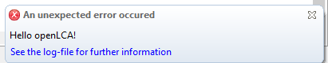
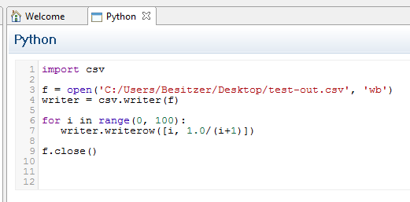
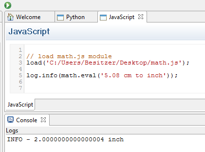
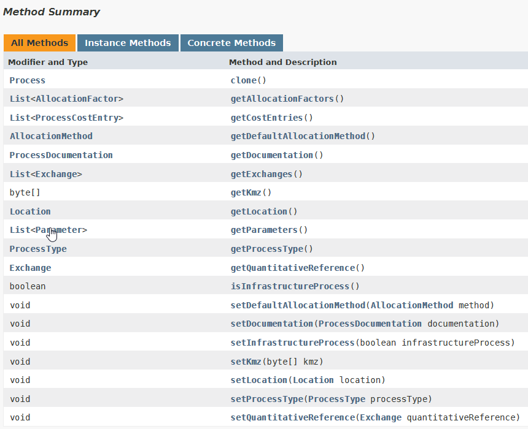
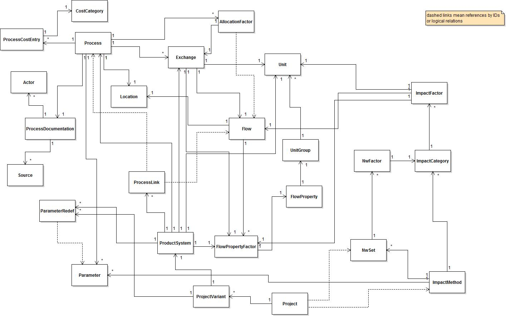

# Scripting in openLCA

<div style='text-align: justify;'>

Since version 1.7.0, openLCA supports the possibility to run Python and
JavaScript programs directly in openLCA. With this feature, you can automate
calculations in openLCA, write your own data imports or exports, perform
sensitivity analysis calculations by varying parameter values, and much more.
You can find the scripting feature under the developer tools menu in openLCA:

  
_Accessing scripting_

As shown below just click on the language you want to use, and an editor will
open where you can write your scripts. To make debugging output visible, we
directly connected the openLCA logger to the scripting environment. Thus, when
you write scripts it is helpful to open the logging console in openLCA
(File/Preferences/Logging):

  
_openLCA logger for scripting_

After this, we can execute our first script (note that it takes a bit to
initialize the Python interpreter when you execute a script the first time in
your current openLCA session). Just write the following text in the editor and
press the run button in the toolbar:

  
_Running script example_

We can also log an error via

    log.error("Hello openLCA")

This will show an error popup in openLCA:

  
_Error popup_

As it is written in the popup, these logs are also written to the openLCA
log-file which you can find in your user directory.

To execute a script, you click on the Run button in the toolbar of the Python
editor ():

  
_Run button in the toolbar_

The script is executed in the same Java process as openLCA, thus with having
access to all the things that you can do with openLCA via this scripting API
(and to everything that you can do with the Java and Jython runtime). Here is a
small example script that will show the information dialogue below when executed
in openLCA:

```python
from org.openlca.app.util import UI, Dialog

from org.openlca.app import App

def say_hello():
  Dialog.showInfo(UI.shell(), 'Hello from Python (Jython)!')

if \__name_\_ == '__main__':
  App.runInUI('say hello', say_hello)
  
```
		
  
_Output of code_

As said above, Jython runs on the JVM. It implements a great part of the Python
2.7 standard library for the JVM, which can be found
[here](http://www.jython.org/docs/library/indexprogress.html). For example, the
following script will work when you set the file path to a valid path on your
system:

    import csv

    with open('path/to/file.csv', 'w') as stream:
        writer = csv.writer(stream)
        writer.writerow(["data you", "may want", "to export",])

The Jython standard library is extracted to the python folder of the openLCA
workspace which is by default located in your user directory
\~/openLCA-data-1.4/python. This is also the location in which you can put your
own Jython 2.7 compatible modules. For example, when you create a file
tutorial.py with the following function in this folder:

    \# \~/openLCA-data-1.4/python/tutorial.py
    def the_answer():
        f = lambda s, x: s + x if x % 2 == 0 else s
        return reduce(f, range(0, 14))

You can then load it in the openLCA script editor:

    import tutorial
    import org.openlca.app.util.Info as Info

    Info.showBox('The answer is %s!' % tutorial.the_answer())

An important thing to note is that Python modules that use C-extensions (like
NumPy and friends) or parts of the standard library that are not implemented in
Jython are not compatible with Jython. If you want to interact from standard
CPython with openLCA (using Pandas, NumPy, etc.) you can use the [openLCA-IPC
Python API](https://github.com/GreenDelta/olca-ipc.py).

A tutorial of how to use python in openLCA can be found
[here](https://github.com/GreenDelta/openlca-python-tutorial).

### The Python interpreter

openLCA integrates Jython 2.7 (<http://www.jython.org/>) as Python interpreter.
Python is a fully-featured programming language that supports imperative,
object-oriented, and functional programming paradigms. Additionally, Python is
very easy to learn so that you can quickly get started. Jython also comes with a
powerful part of the Python standard library. For example, you can use the csv
module (<http://www.jython.org/jython-old-sites/docs/library/csv.html>) to read and write csv
files directly in openLCA:

  
_Read and write csv files in_

### The JavaScript interpreter

The JavaScript interpreter that openLCA uses directly comes with the Java 8
runtime which is included in openLCA
(<http://www.oracle.com/technetwork/articles/java/jf14-nashorn-2126515.html>).
Like Python, JavaScript is a programming language that supports imperative,
object-oriented, and functional programming paradigms. Due to the modern web,
JavaScript is currently one of the most popular programming languages. Note,
that the JavaScript runtime in openLCA fully supports the JavaScript language
but that the runtime platform is not the browser but openLCA (i.e. there is no
window-object or DOM as in a web-browser). However, you can load other
JavaScript files; e.g. you could use math.js (<http://mathjs.org>) in openLCA
via the load-function (the same works with execfile for Python):

  
_Loading JavaScript files_

### The olca-object and the inspection function

To provide an entry point to the openLCA API[^1] you have access to an object
with the name *olca* which provides a set of useful methods. For example, you
could log the names of all processes in a database with the following Python
script[^2]:

[^1]: API stands for Application Programming Interface

[^2]: Note that you need to open a database when you want to access data via the
    script API.

    for descriptor in olca.getProcessDescriptors():
    log.info(descriptor.name)

One of the most useful methods of the *olca*-object is the *inspect* function
which takes an object as an argument and writes the object´s protocol to the
logging console. For example, if we want to know which methods we can call on a
process descriptor object we could write:

    olca.inspect(olca.getProcessDescriptors()[0])

This will take the first process descriptor object from the database (or give an
error if we do not have a process in the currently opened database) and print
the protocol of the object to the logging console:

    protocol:
    
        compareTo(BaseDescriptor) : int
        compareTo(Object) : int
        equals(Object) : boolean
        getCategory() : Long
        getClass() : Class
        getDescription() : String
        getId() : long
        getLocation() : Long
        getModelType() : ModelType
        getName() : String
        getProcessType() : ProcessType
        getQuantitativeReference() : Long
        getRefId() : String
        hashCode() : int
        isInfrastructureProcess() : boolean
        notify() : void
        notifyAll() : void
        setCategory(Long) : void
        setDescription(String) : void
        setId(long) : void
        setInfrastructureProcess(boolean) : void
        setLocation(Long) : void
        setName(String) : void
        setProcessType(ProcessType) : void
        setQuantitativeReference(Long) : void
        setRefId(String) : void
        setType(ModelType) : void
        toString() : String
        wait() : void
        wait(long) : void
        wait(long, int) : void

In this protocol,	 each line describes a method you can call in the following
form:

    [method name] ( [type of argument 1] [type of argument 2] ... ) : [return type]

For getter methods with no arguments, we can use a simplified form in the Python
interpreter:

instead of

    descriptor.getName()

we can also write

    descriptor.name

To see the methods of the olca-object we can also call the inspect method on the
olca-object itself:

    olca.inspect(olca)

In the protocol that is now written to the console we can see for example the
following method:

    getProcess(String) : Process

This means that we can get a process for a string (which is the name of the
process). The following script will load the process with the name “compost
plant, open” from the database and write the process name and protocol to the
console:

    process = olca.getProcess("compost plant, open")
    log.info(process.name)
    olca.inspect(process)

### Modifying database content

The *olca*-object also contains methods like *insertProcess* or *updateProcess*
which – like the names say – will insert a new process object or update an
existing process in the currently opened database. The following example loads
the process with the name p1 from the databases, clears the current parameter
list of this process, adds 10 new parameters to this process, and finally
updates this process in the database:

    # get the process p1 from the database
    process = olca.getProcess("p1")

    # remove the current process parameters
    process.parameters.clear()

    for i in range(1, 11):
        # create a new parameter object
        param = Parameter()
        param.name = "p%s" % i
        # set it as an input parameter
        param.inputParameter = True
        param.value = i/42.0 \* 5000
        # add the parameter to the process
        process.parameters.add(param)

    # update the process in the database
    olca.updateProcess(process)

### Running Calculations

In the following example the product system “dung slab” is calculated with the
LCIA method “CML 2001” and the results are written to the console (if you are
not sure which methods you can call on a result type, just call the *inspect*
method of the *olca*-object with the result type as parameter):

    result = olca.calculate(
        olca.getSystem("dung slab"),
        olca.getMethod("CML 2001") )

    for i in result.totalImpactResults:
        log.info("LCIA category = {}, result value = {}, unit = {}",
            i.impactCategory.name, i.value,
            i.impactCategory.referenceUnit)

By using the Python standard library, we can easily export our results to a CSV
file:

    # import the Python CSV module
    import csv

    # calculate the product system
    result = olca.calculate(
    olca.getSystem("dung slab"),
    olca.getMethod("CML 2001") )
    
    # open the export file
    f = open('C:/Users/Besitzer/Desktop/results_out.csv', 'wb')
    writer = csv.writer(f)
    
    # write the results to the file
    for i in result.totalImpactResults:
        row = [i.impactCategory.name, i.value,
        i.impactCategory.referenceUnit]
        writer.writerow(row)
    
    # close the file
    f.close()

You could now combine the calculation with a parameter modification as described
above to make advanced sensitivity analyses with openLCA. Also, the analysis
function and Monte Carlo Simulation are available via the olca-object:

    # run a Monte Carlo Simulation with 10 iterations
    system = olca.getSystem("dung slab")
    result = olca.simulate(system, 10)
    
    # for each flow write the result of each iteration
    for flow in result.flowDescriptors:
        i = 1
        for r in result.getFlowResults(flow):
            log.info("flow: {}, iteration: {},             result: {}", flow.name,
            i, r)
            i += 1

### Using more functions from the API

With the scripting interface in openLCA, you have full access to all functions
in openLCA. The *olca*-object just provides some entry points to the API. The
full API documentation of the core openLCA modules is available on our GitHub
repository: <http://greendelta.github.io/olca-modules/>. The figure below shows
some method declarations in the API documentation of the Process class. These
methods are the same as the *inspect* method will print when you call it with a
process object as a parameter.

  
_Method declarations in the API documentation_

To use a class in your script you need to import it. There is, for example, a
class *CategoryPath* available in the package *org.openlca.io* which translates
a category hierarchy in openLCA into a string path. The following script shows
how you could use this class in a Python script:

    # import the class
    import org.openlca.io.CategoryPath as path
    
    # load a process
    process = olca.getProcess("compost plant, open")
    
    # print the full category path of the process
    log.info(path.getFull(process.category))
    
    # print the short category path of the process
    log.info(path.getShort(process.category))

And here is the same in JavaScript:

    // import the class
    var path = Java.type('org.openlca.io.CategoryPath');
    
    // load a process
    var process = olca.getProcess("compost plant, open");
    
    // print the full category path of the process
    log.info(path.getFull(process.category));
    
    // print the short category path of the process
    log.info(path.getShort(process.category));

For the core model classes, you do not need to add import declarations. So, you
can directly write the following to create a new process object in Python and
inspect it (see also the parameter example above):

    process = Process()
    olca.inspect(process)

And in JavaScript:

    var process = new Process();
    olca.inspect(process);

Finally, the following picture shows the classes and the dependencies between
these classes of the core model:

  
_Classes and dependencies of the core model_

