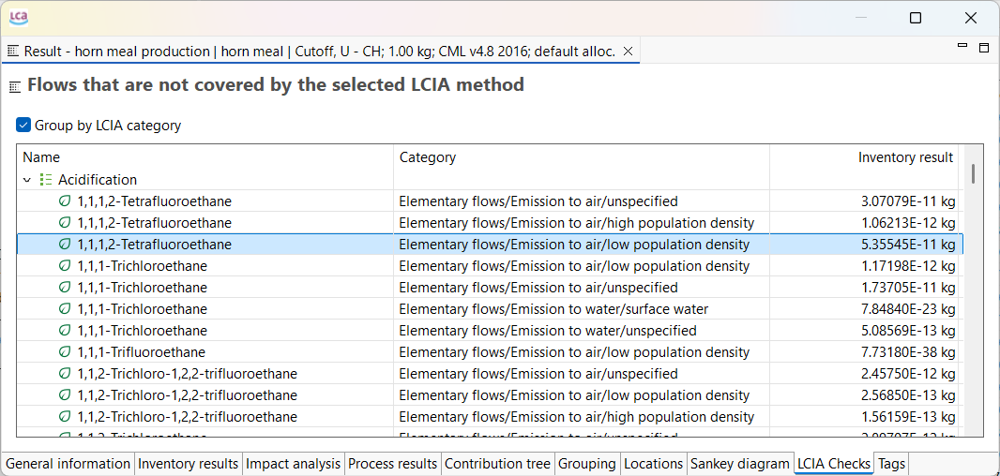

# Model Validation in openLCA

In a life cycle assessment (LCA), it is not enough to simply construct a model and calculate results. According to the ISO 14040/14044 standards, the study must also be validated to ensure that it reflects the intended goal and scope. Validation is about confirming that the model is complete, consistent, and reliable. openLCA provides several features to help practitioners perform this step systematically.

openLCA supports LCA practitioners in conforming to the ISO14040/14044 by:
- Identification of significant issues (Gravity/Pareto Analysis)
- Consistency check
- Completeness check
- Sensitivity check and Uncertainty analysis

## Identification of significant issues

The first step in interpretation is to structure the LCI and LCIA results to highlight the most relevant aspects of the study. Significant issues may include large contributions of certain flows (e.g., energy, emissions, waste), specific impact categories (climate change, resource use, etc.), or particular life-cycle stages and processes (transport, energy supply, production steps). openLCA supports this step through the [**Contribution Tree**](./res_analysis/res_contribution_tree.md) and [**Sankey Diagram**](./res_analysis/res_sankey.md), which visualize dominant processes and flows. Users can interactively navigate through subprocesses, identify hotspots, and document findings. By focusing on the most influential contributors, practitioners can improve data quality and ensure that conclusions are based on significant elements of the system.

  

Beyond highlighting contributors, openLCA also lets you probe the structure of the product system directly. For example, you can disconnect selected processes, see [**Model Graph**](./prod_sys/model_graph.md), to test for inconsistencies in mass or energy balances, or to explore the role of specific flows such as energy use or transport demand:

  
  

The respective inventory will display the amount of needed energy or transport over the whole supply chain, as the processes have been removed from the whole supply chain.

  

This logic allows you to investigate the disaggregated life cycle inventory in detail, but also to review mass and energy balances if you consider the whole life cycle of a product. As seen here, the sum of product flows equals to the sum of the waste flow:

  

## Consistency check

The consistency check ensures that the assumptions, methods and data are applied in a coherent manner throughout the study. This involves verifying that differences in data quality are justified by the goal and scope, that regional and temporal aspects are handled in a uniform way and that system boundaries and allocation rules are applied consistently across all modeled systems. The same principle applies to the use of impact assessment methods, which should be applied consistently across the study. openLCA facilitates the consistency check by helping practitioners verify that methodological choices and data are applied in a coherent way across the study. This includes ensuring that allocation settings (e.g. economic throughout all processes in [**calculation setup**](./prod_sys/calculating.md)) or numeric cut-off rules (see [**product system setup**](./prod_sys/Creating.md)) are defined uniformly within the product system:

  
  

openLCA supports the user further by handling units and flow properties consistently throughout the database, see [**Background data**](./databases/database_elements.md). Databased that are obtained from openLCA Nexus already hold harmonized units and flow properties. This avoids errors caused by mismatched units or flow definitions and ensures that all data can be compared and aggregated reliably, for example, by automatically converting grams to kilograms or kWh to MJ when needed. Further, tools such as the [**Parameter Sets**](./parameters/parameter_sets.md) and the scenario definitions within [**Projects**](./projects/new_proj.md) allow users to systematically review and confirm that assumptions are applied consistently across all model variants. This means that when exploring alternative scenarios (e.g., different energy mixes, technologies, or allocation rules), openLCA helps ensure that changes are applied in a controlled and transparent way, making comparisons between scenarios more robust.
Further, assessing the data quality of your inventory and impact results can be performed by adding [**Data Quality**](./advanced_top/data_quality.md) assessment during the calculation phase. This indicates whether the flows and processes that contribute most to the results are supported by high-quality data, helping practitioners identify hotspots where data may need to be improved or replaced.

  

## Sensitivity checks and uncertainty analysis

The sensitivity check examines how robust the results are when faced with uncertainties in data, modeling choices, or calculation procedures. This means testing whether the conclusions change significantly if input data varies, if allocation methods are adjusted, or if certain assumptions are altered. openLCA supports this by allowing you to perform sensitivity and uncertainty analyses and observe how the results respond.
openLCA supports sensitivity checks by offering integrated options for parameter variation and scenario variation. You can use parameters in your foreground model and adjust these at several stages of the openLCA database hierarchy. In the product system, you can then adjust them systematically via parameter sets and rerun the calculations to observe changes in results. [**Projects**](./projects/new_proj.md) in openLCA make it easy to compare different scenarios side by side, allowing the re-definition of parameters between scenarios of the same product system.
A relevant example could be to prove your assumption that the catalyst within the PET granulate product could be omitted in your LCA study as they fall under your cut-off criteria (<1% of mass inputs). To later demonstrate this assumption, you perform a sensitivity analysis using openLCA’s project function.

  

As visualized, in most impact categories, the change of impacts was rather marginal. Hence, this backs the previously made assumption. However, if this would be more drastic, the outcomes of the sensitivity analysis would imply to redesign the LCA studies’ assumptions. 
Uncertainty analysis in openLCA is done by allowing uncertainty information to be stored with input and output data that can be applied during calculations. Then, [**Monte Carlo Simulation**](./advanced_top/monte_carlo.md) simulations can be performed directly in the software to generate a distribution of results rather than a single point value. The outcomes can then be visualized, making it possible to evaluate how stable the study’s conclusions are when accounting for uncertainties.

  

## Completeness check 

A completeness check verifies that all the necessary data and information are available for the calculation of results. If important processes or flows are missing, you need to evaluate whether they are critical to fulfilling the goal and scope of the study. This can be performed in certain ways in openLCA. After you finished modelling, you should check that the validation of your database does not return any errors and that all providers are set across your entire database. openLCA supports this process through database validation and the 'Check linking properties' function, see [**Toolbar**](./running_olca/toolbar_database.md) . The latter scans the database for unlinked product flows and waste flows. Running this check helps ensure that all exchanges are properly connected. Databases provided on openLCA Nexus are offered with a clean validation check and in cases of high-quality databases, also the “Linking Properties” of the database look like this:

  

If you run into linking errors, analyze the reasons. If it is due to data you changed in the background data, you can export your foreground model and re-imported into a new database. Some background databases hold flows with several providers which is not a problem just should be taken care of that in the procecces are respetive 'default provider' is set to prevent ambiguity.

Another layer of completeness is required to be tested on the LCI and LCIA level. Initially, you have to make sure that your life cycle inventory does not hold any product flows anymore, as they will not be characterized by the LCIA method.

  

Once done, you have to make sure that during the impact assessment, undefined or unmapped elementary flows are minimized as they can compromise the completeness and reliability of the results. Here, openLCA supports you here with the [**LCIA Checks**](./res_analysis/res_lcia_checks.md) tab of the [**Result**](./res_analysis/analysis.md) window in post-calculation by displaying all the flows that are not assessed in the respective impact category.

  

If you find here elementary flows that should be assessed, you have to provide them a [**characterization factor**](./lcia_methods/impcat_cfs.md)  in the method or exchange them in the respective process. This can occur due to mis-mapping of flows, e.g. carbon dioxide (fossil) vs. carbon dioxide, fossil. Only one of them is commonly assessed.

