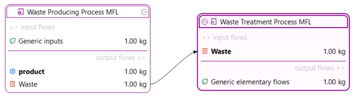
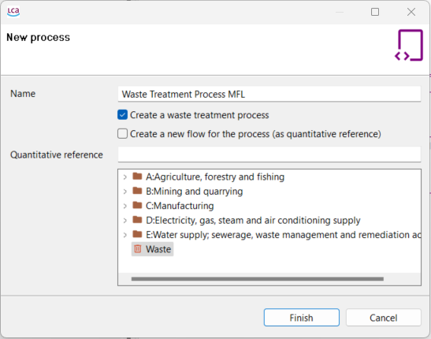
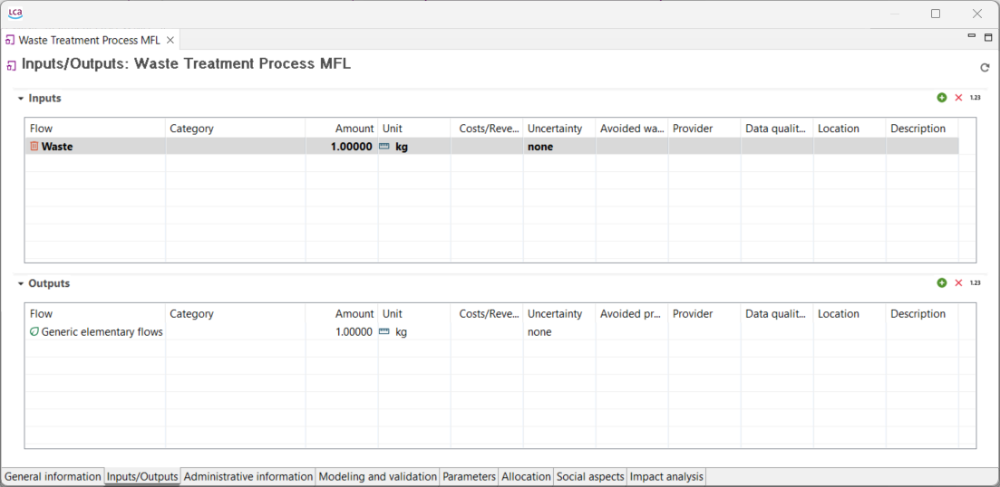
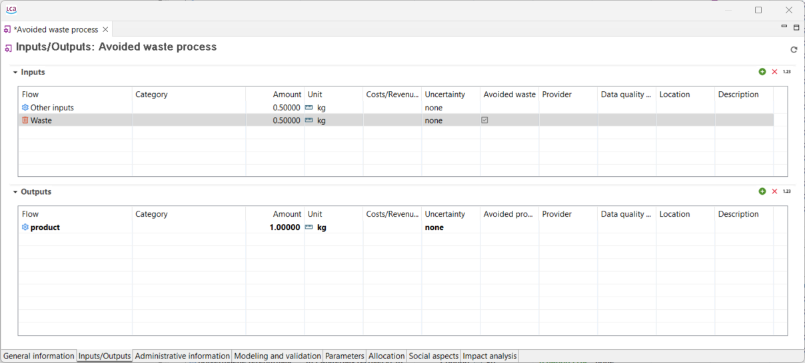
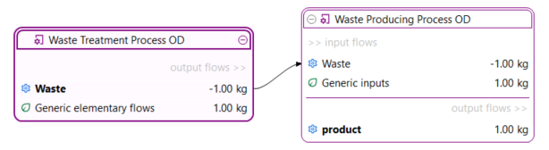
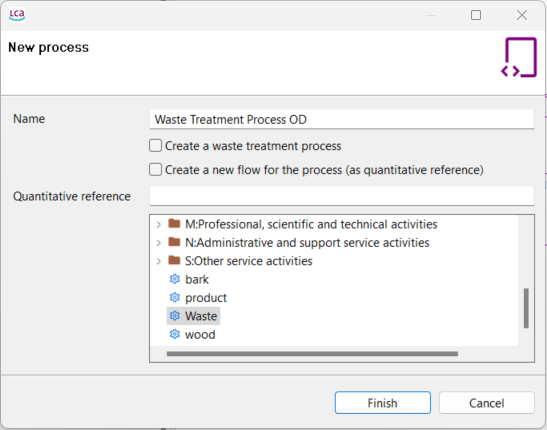
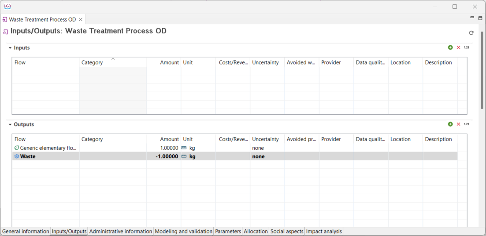

# Waste modelling

Waste represents any substance or object that that needs to be dispose of, like by-products with no market value, and it can be generated at any stage of a product's life cycle. In openLCA are represented by a specific "[Flow](../flows/README.md)" type.

- Material flow logic approach
- Opposite direction approach

## Material flow logic

This approach aligns with the "actual" direction (i.e. material flow direction) of what is being modelled and was introduced with openLCA 1.7. Waste flows are generated as outputs of waste generating processes. In waste treatment processes they serve as the quantitative reference, and can be found on the input side.

  
_Model graph displaying the material flow logic_

### Creating a waste treatment process (material flow logic)

1. Right-click "Processes" &#8594; "New process"  &#8594; "Create a waste treatment process".
2. 2.	Choose a (previously created) waste flow as your quantitative reference &#8594; click "Finish". The chosen waste flow is now an input to your waste treatment process.

  
_Creation of a waste treatment process, material flow logic_

  
_Waste producing process following the material flow logic_

  
_Waste treatment process following the material flow logic_

_**Note:**_ If waste are consumed by a process, system expansion can be applied by checking the box "Avoided waste", as the waste consumed does not need waste treatment elsewhere. A process providing the benefit of using waste as an input can be credited with the avoided impact of having to treat that waste elsewhere. 

  
_Waste input flow is marked as avoided waste_

## Opposite direction approach

The opposite direction approach works the other way around, and makes it possible to model waste treatment without the use of waste flows, but using normal process flows instead. This was the only option up until openLCA 1.7. It is still worth to mention, especially if you're working with older databases that may not include waste flows. As waste is the quantitative reference of a waste treatment process, but a quantitative reference cannot be an input to a process (since it is, essentially, the main product/output of a process), waste treatment is seen as a service necessary to provide to waste generating processes. The waste then appears as a negative output (an input) of the waste treatment process, and analogously as a negative input (an output) of the waste generating process.

  
_Model graph displaying the opposite direction approach_

### Creating a waste treatment process (opposite direction approach)

1. Add the waste (type: product) flow as a negative output of a waste treatment process.
2. Add the waste (type: product) flow as a negative input to the waste producing process considered.

  
_Creation of a waste treatment process, opposite direction approach_

  
_Waste treatment process following the opposite direction approach_

The reason there are two different approaches is because different databases manages waste in different ways, i.e. waste flows are not present in all databases.  

 

